# Zerolan Live Robot 源码之旅

> 一本带你从零理解、上手并改造一个开源 AI 主播项目的技术书。
>
> 项目版本：v2.3.0
> 写作进度：第 3 章 / 共 13 章
> 大纲版本：v4.0（彻底重构版）

---

## 章节目录

第一部分 · 建立印象（让你能想象它是什么）

1. [这是什么：一个能听能说能动的 AI 主播](#第-1-章-这是什么一个能听能说能动的-ai-主播) ✅
2. [第一次启动：从装环境到让它给你回第一句话](#第-2-章-第一次启动从装环境到让它给你回第一句话) ✅

第二部分 · 建立核心心智模型（让你能在脑子里画出它怎么运转）

1. [一句"你好"的完整旅程](#第-3-章-一句你好的完整旅程) ✅
2. 进程、线程、事件：它"动"起来的三层结构 ⬜

第三部分 · 模块深入（让你能改任意一处代码）

1. 事件总线：所有模块的"广播电台" ⬜
2. 配置系统：一份模型，三处生效 ⬜
3. Pipeline：远端 AI 调用的统一窗口 ⬜
4. Service 与 Device：连接外部世界与本机外设 ⬜
5. Agent：让 LLM 学会调用工具 ⬜

第四部分 · 合起来看（让你能复盘整个项目）

1. 启动流程的完整复盘 ⬜
2. 工程化：测试、部署、日志 ⬜
3. 已知技术债与重写思路 ⬜
4. 附录：术语表 / FAQ / 概念地图 ⬜

---

# 第 1 章 这是什么：一个能听能说能动的 AI 主播

## 1.1 在开始之前

### 🎯 读这章你将获得什么

读完这一章，你应该能在饭桌上用三分钟向同学描述清楚：

- Zerolan Live Robot 这个项目到底是个什么东西
- 它能做哪些具体的事，做不到哪些事
- 它跟你在 B 站或 YouTube 看过的"AI 主播"是什么关系
- 你的电脑要满足什么条件，才有资格把它跑起来

也就是说，**这一章不教你任何技术**。它的任务只有一个——让你脑子里建立起这个项目的"样子"。

### 📋 这章假设你已经知道什么

只需要知道：

- 什么是"一个程序"——你写过几行 Python，跑过 `python xxx.py`，知道程序会读取输入、做点事情、然后输出
- 什么是"配置文件"——比如游戏里那个调画质的设置面板背后，可能就是一个文本文件
- 大概听说过"AI 模型"是个能根据输入猜输出的东西

如果以上你都没问题，就可以继续。**不需要懂**任何架构、模式、并发、网络协议——那些东西我们在后面的章节里再讲。

### 🆕 这章会引入的新概念

只有一个：**AI VTuber**。其它都是日常词汇。

阅读时间预估：约 25 分钟。

---

## 1.2 五分钟体验：从你的视角看它长什么样

为了让你建立第一印象，我先描述一段"使用场景"。这段场景**并不会教你怎么操作软件**，只是让你像看视频回放一样，从一个普通用户的视角，看看 Zerolan Live Robot 跑起来是个什么样子。

---

> 你下班回家，打开电脑。
>
> 桌面右下角，有一个透明背景的小窗口，里面是一个二次元风格的少女。她会自动眨眼，胸口会一上一下地呼吸，像是真的活着。她的名字叫"小铃"，你昨天给她起的。
>
> 你按下键盘上的 `F8`，对着麦克风说了一句："你今天怎么样？"
>
> 大概一秒钟之后，小铃抬起头，嘴巴跟着声音一开一合，回了一句："还不错呀！你呢？刚下班吗？"
>
> 与此同时，你的 OBS 直播软件里，画面下方多了一行字幕，先打出你的话"你今天怎么样？"，然后慢慢一个字一个字地打出小铃的回答——就像电影里那种打字机效果。
>
> 你又说："看一下我屏幕上有什么。"
>
> 小铃的语气里带了点好奇："唔……你打开了一份代码，看起来是 Python 写的。还有一个浏览器，标签页是 GitHub。在写新项目吗？"
>
> 你打开 B 站直播间开始直播。直播间里有人发了条弹幕："小铃今天好看吗？"
>
> 小铃自己读到了那条弹幕，自然地回了一句："今天也很可爱哦，谢谢观众朋友！" 这句话没经过你的麦克风，它是自己看到弹幕、自己决定回复、自己说出来的。
>
> 你切换到 Minecraft 游戏窗口，对着麦克风喊："小铃，去游戏里跟大家打个招呼！"
>
> 几秒钟之后，Minecraft 的聊天框里出现了一条游戏内消息："你们好呀！我是小铃！"——是游戏里一个 NPC 角色帮她说的。

---

这段场景里发生的所有事情，**都是这本书要讲的开源项目 Zerolan Live Robot 能做到的**。它不是宣传片，不是 PPT 上的愿景——它是这个 9000 多行 Python 代码的项目，已经实现的能力。

现在，我们要把"小铃做了什么"这件事，从你刚才读到的"画面"，慢慢翻译成"程序做了什么"。

---

## 1.3 它到底是个什么东西？

如果你现在让我用一句话回答"Zerolan Live Robot 是什么"，我会这样说：

> **Zerolan Live Robot 是一个可以跑在你自己电脑上的、长着"AI 大脑"的虚拟主播 / 桌面陪伴程序。**

这句话里有几个词我得展开讲一下。

### 第一个词：跑在你自己电脑上的

**它是一个本地程序**。不是一个网站，不是一个手机 App，不是云服务。它是一段 Python 代码，下载到你硬盘上，用命令行启动后，会一直在你的电脑里运行——就像你打开一个 QQ、一个网易云音乐那样。

为什么这件事重要？因为对比一下：

- ChatGPT 是云服务。你发的每句话都会上传到 OpenAI 的服务器，他们的电脑算完之后再传回结果。**你的数据在别人手里**。
- 某些商业的 AI 主播软件，也是要登录账号、调用云端 API 才能用。**你停止付费就用不了**。
- Zerolan Live Robot **可以**完全本地运行。前提是你的电脑足够强（后面会讲配置要求）。**你想关就关，想改就改，想存什么数据都在你自己电脑里**。

当然，它也支持你"图省事"地调用云端 AI（比如 OpenAI API）。但这只是一个选项，**不是必需**。

### 第二个词：长着"AI 大脑"

**它真正"动脑子"的部分，是大语言模型 (Large Language Model, 简称 LLM)**。

我猜你听说过 ChatGPT、文心一言、通义千问、DeepSeek——这些都属于"大语言模型"。它们的本事是：你给它一段文字，它会顺着你的话说下去，且听起来像人话。

Zerolan Live Robot 里那个虚拟少女"小铃"会的所有自然语言对话，其实都是它把你说的话转成文字，再把文字交给一个大语言模型，让模型生成回复，最后再把回复转成语音播放出来。

📎 **小贴士：那"AI" 是不是就等于"大语言模型"？**

不完全是。"AI" 是个很宽的词，目前最火、最普及的一种 AI 叫"大语言模型"，但 AI 还包括很多别的——比如把一段录音转成文字的"语音识别 (ASR)"、把一段文字念成声音的"语音合成 (TTS)"、看一张图片说出里面有什么的"图像识别"等等。这些都是 AI。Zerolan Live Robot 里**同时用到了这一整套**，下面 1.4 节会一个一个说。

### 第三个词：虚拟主播 / 桌面陪伴

**它的"皮"是一个会动的虚拟形象**。

你在 1.2 节看到的"二次元少女小铃"，是一种叫做 **Live2D** 的技术做出来的——简单说就是把一张 2D 立绘切成很多个图层（头、眼睛、嘴、头发……），然后用程序去拉伸、旋转这些图层，让它看起来像在动。它不是 3D 模型，本质上还是 2D 图片在动。**Live2D 现在是大多数 V 家主播（VTuber）使用的形象技术**。

这个项目可以：

- 渲染一个 Live2D 形象在你桌面上（背景透明，可以悬浮在所有窗口上层，像个桌面宠物）
- 让形象的嘴巴跟着说话的声音开合（叫"嘴型同步"或者"对口型"）
- 让形象自动呼吸、自动眨眼（不然会很死板）
- 把这个形象嵌进 OBS 直播软件的画面里（你就可以拿它去 B 站直播）
- 也可以把这个形象通过一个 Unity 程序拉成 3D / AR 形态

🆕 **新概念：AI VTuber**

**VTuber** 是"Virtual YouTuber"的缩写，中文叫"虚拟主播"——指的是用一个虚拟形象（而不是真人脸）做直播的主播。

**AI VTuber** 则是再进一步：连皮套后面的"中之人"（操控形象的真人）都换成了 AI。换句话说，**整个主播都不是真人，是程序自己在跟观众互动**。

最有名的 AI VTuber 叫 [Neuro-sama](https://virtualyoutuber.fandom.com/wiki/Neuro-sama)，在 Twitch 上有上百万粉丝。她背后的程序闭源、不公开。Zerolan Live Robot 想做的事情，就是**做一个开源的、人人都能跑、人人都能改的 AI VTuber 框架**。

---

## 1.4 它能做的具体事情清单

读到这里你应该有了个模糊的印象。接下来我把它的能力按"四个职能"系统地展开——

- **感知**：它怎么知道外面发生了什么
- **思考**：它怎么决定要说什么、做什么
- **表达**：它怎么把自己的反应让你看到/听到
- **行动**：它怎么影响电脑里别的程序

每一项我都会给一个具体场景，让你确认"哦原来是这个意思"。

### 一、感知：它能看到/听到什么

#### 1) 听你的麦克风

最基本的能力。你按一下 `F8` 开麦，说话；说完再按一下 `F8` 关麦。它会把你这段录音通过一个叫**自动语音识别 (Automatic Speech Recognition, ASR)** 的程序转成文字。

> 📎 **小贴士：什么是 ASR？**
>
> ASR 就是"录音 → 文字"的程序。你手机微信里那个"按住说话"录完之后会出现的文字稿，背后就是 ASR 在工作。Zerolan Live Robot 也用同样的技术，只不过模型跑在你自己电脑上（或者你指定的远程服务器上）。

#### 2) 读直播间的弹幕

你可以让它连上你的 B 站直播间（YouTube、Twitch 也支持，但作者标注为"实验性"）。一旦观众发弹幕，弹幕的文字内容会被它接收到，它可以决定要不要回应、回应什么。

这就是 1.2 节里"小铃自己看到弹幕、自己回复"的来源。

#### 3) 看你的屏幕

你可以让它截一张你屏幕的图，然后用两种方式理解这张图：

- 如果图上有文字，用一个叫 **OCR (Optical Character Recognition, 光学字符识别)** 的程序把文字"读"出来——就像手机上"识别图片中文字"的功能
- 如果图上没多少文字（比如是一张风景照、游戏画面），就用一个叫**图像描述 (Image Captioning)** 的模型，让 AI 用一句话描述图里画的是什么——比如"一个人在森林里走"

所以 1.2 节里"看一下我屏幕上有什么"那段，背后的过程是：屏幕截图 → OCR 把代码文字读出来 + 图像描述模型识别出有浏览器画面 → 把这些信息交给 LLM → LLM 编出"你打开了一份代码，看起来是 Python 写的，还有一个浏览器"这样的回应。

#### 4) 收 QQ 消息

通过一个叫 **NapCat** 的第三方 QQ 机器人客户端，它能接收别人发到一个 QQ 群的消息——文字、语音、图片都行——然后做出回应。你的 QQ 群一下子就有了一个"群友"。

### 二、思考：它怎么决定说什么、做什么

#### 5) 自然对话

这是 LLM 的本职工作。把你说的话（或弹幕、QQ 消息）作为输入，让 LLM 生成回复。

#### 6) 上下文记忆（短期）

LLM 单独看一句话是没有"记忆"的。如果你说"我刚才告诉你我叫什么"，它根本不知道你之前说过什么。

所以这个项目维护了一份"对话历史"——把最近几轮的对话都保存下来，每次发给 LLM 时把整段历史一起发过去。这样 LLM 就能"记得"之前说过什么。

不过历史不能无限长（LLM 处理太长的内容会变慢、变贵），所以有个**最大历史条数**限制——超过了就把最老的丢掉。

#### 7) 长期记忆（实验性）

光有短期记忆，每次重启程序就忘光了，不够用。所以项目里还引入了一个叫 **Milvus 向量数据库**的东西，专门保存"值得长期记住"的内容。

你可以理解成：每次对话结束，程序会让 LLM 评估一下"这段对话值不值得记住"，如果值得，就存到向量数据库里。下次你问"你还记不记得我之前说过……"，程序会从向量数据库里捞出相关的记忆，作为参考给 LLM。

> 📎 **小贴士：什么是向量数据库？**
>
> 普通数据库（如 MySQL）查数据靠"精确匹配"——你查 `name='小铃'`，它就找名字等于"小铃"的记录。**向量数据库不一样，它支持"相似度搜索"**——你给它一段话，它能从存的所有内容里找出"意思最接近"的几条。
>
> 这是大模型应用里非常常见的一种"外挂记忆"做法。但本项目把它标记为"实验性"，意思是作者也不确定效果有多好，还在调。

#### 8) 情感分析（可选）

为了让它说话更有感情，项目里可以打开"情感分析"——每次 LLM 生成回复之前，先让另一个 LLM 调用判断这段话的情绪是开心、悲伤、生气还是平静，然后给语音合成传递对应的情绪标签。

这样它说"哇你回来啦"和"嗯……我有点累"时，语气是不一样的。

### 三、表达：它怎么让你看到/听到反应

#### 9) 带感情的语音

把 LLM 生成的回复文字，通过 **TTS (Text-to-Speech, 文本转语音)** 程序合成成语音，然后从扬声器播放出来。

如果上面第 8 项的情感分析开了，TTS 还会根据情绪标签选择不同的"音色样本"——开心时用快乐的声音、悲伤时用低沉的声音。

#### 10) Live2D 形象 + 嘴型同步

桌面上那个会动的二次元少女。项目本身用 Python + PyQt5 + OpenGL 实现了一个简单的 Live2D 渲染器，可以放在桌面、做透明背景、自动眨眼、自动呼吸；说话时嘴巴会跟着音频一开一合。

#### 11) Unity 3D / AR 形象（高级，可选）

如果你不满足于 2D，还可以让它连接一个独立的 Unity 程序（叫 [ZerolanPlayground](https://github.com/AkagawaTsurunaki/ZerolanPlayground)），用 Unity 渲染 3D 模型或者基于 Vuforia 的 AR 形态——比如你用手机摄像头扫一张图片，画面里就出现 3D 形象站在那张图片上。

#### 12) OBS 字幕（直播专用）

**OBS** 是免费、最流行的直播软件。Zerolan Live Robot 可以通过 OBS 的 WebSocket 接口，把你说的话和它的回复，自动以打字机效果显示在直播画面下方——观众就能看到完整的"字幕"。

### 四、行动：它能控制别的程序

#### 13) 打开浏览器、搜索

你说"打开浏览器"，它会自动启动 Firefox。你说"网页搜索 XXX"，它会自动在浏览器里搜你说的关键词。你说"关闭浏览器"，它会自动关掉。

这背后用的是一个叫 **Selenium** 的库——本来是用来做网页自动化测试的，作者把它用来做"用嘴控制浏览器"。

#### 14) 鼠标点击屏幕上的按钮

你可以说"点击屏幕上的搜索按钮"。它会：

1. 截一张屏幕图
2. 把图和你说的话交给一个叫 **ShowUI** 的 AI 模型（专门理解 UI 截图的）
3. 模型会回答"搜索按钮的坐标在 (x, y)"
4. 程序用 `pyautogui` 控制鼠标移到那个坐标并点击

这是"看图操作 UI"的早期形态，还不完美，但已经能跑。

#### 15) 操纵 Minecraft 角色

通过一个独立的 Node.js 程序（叫 [KonekoMinecraftBot](https://github.com/AkagawaTsurunaki/KonekoMinecraftBot)）连接到 Minecraft 服务器，Zerolan Live Robot 可以让 Minecraft 里的一个 NPC 角色说话、打怪、砍树、睡觉等等。你只要在主程序里喊"在游戏里跟大家说你好"，几秒之后 Minecraft 聊天框里就会出现这句话。

#### 16) 上下文自动选工具

更进一步——它能根据上下文"自己决定要不要调工具"。你说"好了你可以关机了"，它会调"关机"工具（如果你有定义这个工具的话）。你说"打开浏览器搜搜什么是二次元"，它会先调"打开浏览器"工具再调"搜索"工具。

这背后是 **LangChain 的工具调用 (Tool Calling)** 机制。我们第 9 章会专门讲它。现在你只要知道——**它不是单纯的回话机器，它能"做事"**。

---

把这 16 件事画成一张图，大概是这样：

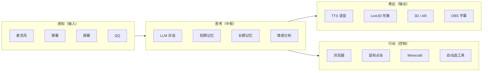


记住这张图——它是这本书的"地图"。后面每个章节，都是在解释这张图里某一块怎么实现的。

> 🤔 **作者推测：这 16 件事是不是都已经"产品级"了？**
>
> 不是。从代码状态看，作者自己有标"实验性"的部分——比如 YouTube/Twitch 接入、长期记忆、ShowUI 鼠标点击。意思是能跑，但不一定稳。**这是开源项目的常态，不是 bug——你看到的是一个真实在演进中的项目，不是一份打磨完美的产品。**

---

## 1.5 它需要什么才能跑起来？

光看能力清单是不够的——你得知道你的硬件、网络、技术储备够不够，才有资格把它装起来。

### 你需要一台什么样的电脑？

最低门槛：

- **操作系统**：Windows 10/11（首要支持），或 Linux（部分功能受限，比如 Live2D 渲染依赖 `live2d-py` 库目前只在 Windows 上跑）
- **Python 版本**：**必须 3.11**（不能是 3.10 或更低，因为代码用了 `asyncio.TaskGroup` 等 3.11+ 才有的新 API；也不能是 3.12+，因为部分依赖库还没适配）。README 当前写的是"3.10 或 3.11"，但实测 3.10 起不来——以**代码事实**为准
- **内存**：至少 8 GB
- **磁盘**：至少 10 GB 空闲

如果你想让"AI 模型"跑在你自己电脑上（而不是调云端 API），那 **显卡就很重要**：

- **显卡（GPU）**：建议 NVIDIA RTX 3060 (12GB 显存) 起步
- **显存**：决定你能跑多大的 LLM。8GB 显存只能跑 7B 参数的小模型；12GB 能跑 13B；24GB 能跑 30B

这是因为大语言模型的运行需要把模型权重加载到显存里。模型越大，需要的显存越多，回答质量也通常越好。

> 📎 **小贴士：什么是"参数"？什么是"7B"？**
>
> 大语言模型本质上是一个有非常多"可调旋钮"的数学函数。**参数 (Parameter)** 就是这些旋钮的数量。"7B" 表示 70 亿个 (Billion) 参数。每个参数通常用 2 个字节（半精度浮点数）保存，所以 7B 模型大概需要 14 GB 显存（实际还要算上中间计算的开销，所以更多）。
>
> 参数越多，模型越聪明（一般情况下），但也越慢、越占显存。

### 你需要"AI 模型服务"

这一条是最大的门槛，也是新人最容易迷糊的地方。我重点解释。

**Zerolan Live Robot 本身不包含任何 AI 模型**。它只是一个"调度程序"——你说话之后，它把录音"发"给一个 AI 模型，让 AI 模型处理后把结果"传"回来。

那 AI 模型在哪里？有三种选择：

#### 选择 A：在你自己的电脑上跑模型（推荐给有显卡的玩家）

作者另外维护了一个项目叫 **ZerolanCore**（[GitHub 链接](https://github.com/AkagawaTsurunaki/zerolan-core)），它的作用就是：**在你电脑上启动一堆 AI 模型，然后开放一个本地的 HTTP 接口**，让 Zerolan Live Robot 来调用。

你启动 ZerolanCore 之后，相当于本地起了一个"AI 服务"，地址类似 `http://127.0.0.1:11000/llm/predict`。Zerolan Live Robot 通过这个地址跟 AI 模型对话。

这种方式的好处：**数据完全不出你的电脑**；坏处：**你的显卡要够强**。

#### 选择 B：用云端 AI API（推荐给没显卡的玩家）

你可以不装 ZerolanCore，直接用 OpenAI、百度、阿里、智谱等公司提供的云端 AI API。Zerolan Live Robot 支持几种主流的第三方接口。

这种方式的好处：**不需要显卡，月费几十块就能用**；坏处：**数据要上传到第三方**。

#### 选择 C：混搭

比如 LLM 用云端 API（最贵、最吃显卡），ASR 和 TTS 用你本地（不那么贵，但有数据隐私需求）。这是大多数人实际会选的方式。

不管哪种选择，你都必须**至少配置好三件东西**才能让它跑起来：

- **LLM**（让它能"想"）
- **ASR**（让它能"听"）
- **TTS**（让它能"说"）

OCR、图像描述、向量数据库等等都是可选的——不配也能跑，只是少几个功能。

### 你需要的"周边软件"（按需）

下面这些都是**可选**的——你想用对应的功能才需要装：


| 功能            | 需要装什么                                                 |
| ------------- | ----------------------------------------------------- |
| 直播间字幕推送到 OBS  | 装 **OBS Studio**，并在 OBS 里开启 WebSocket 服务器             |
| 让它连 QQ 群      | 装 **NapCat**（一个 QQ 机器人后端）                             |
| 让它玩 Minecraft | 装 **KonekoMinecraftBot**（项目自带的 Node.js Minecraft 智能体） |
| 用 3D / AR 形象  | 装 **ZerolanPlayground**（一个 Unity 程序）                  |
| 用浏览器控制        | 装 **Firefox** + Selenium 的 WebDriver                  |
| 用长期记忆         | 装 **Milvus** 向量数据库（通常装在 Docker 里）                     |


听起来很多，但你完全可以**只装最小化的那一套**——只跑 LLM/ASR/TTS，先让它能跟你对话起来，其它功能等用到再说。

### 网络条件

如果你选了"选择 A"（本地全跑模型），并且不让它读弹幕、不连 QQ、不调 OpenAI API，那 **理论上你完全断网也能用**。这是它跟商业 SaaS 最大的区别之一。

如果用云端 API 或者要读直播弹幕，那当然需要网络。

---

## 1.6 它和你听说过的东西有什么关系？

### 它跟 Neuro-sama 像在哪里？

很多人是先听说过 Neuro-sama，再来找"自己能不能搞一个"的。我们对比一下：


|      | Neuro-sama              | Zerolan Live Robot   |
| ---- | ----------------------- | -------------------- |
| 开源   | ❌ 完全闭源                  | ✅ 完全开源（MIT 协议）       |
| 谁能用  | 只有作者 Vedal 能控制          | 任何人下载就能跑             |
| 跑在哪里 | Vedal 自己的服务器            | 你自己的电脑               |
| 形象   | Live2D 二次元少女            | Live2D 二次元少女（或自己换）   |
| 能听能说 | 能                       | 能                    |
| 能玩游戏 | 能（玩 osu! / Minecraft 等） | 能（目前主要是 Minecraft）   |
| 能读弹幕 | 能（Twitch 弹幕）            | 能（B站/YouTube/Twitch） |


可以理解为：**Zerolan Live Robot 是"开源版的 AI VTuber 框架"**，瞄准的是 Neuro-sama 这个赛道，但它不打算做成"一个固定的角色"，而是"一个让你做出自己角色的工具"。

如果你想要"一个自己的 Neuro-sama"，这个项目就是给你写的。

### 它跟 ChatGPT 有什么区别？

最关键的区别：**ChatGPT 是一个"网页对话"，Zerolan Live Robot 是一个"能听能说能看能动的形象"。**

如果非要用 ChatGPT 类比，那 Zerolan Live Robot 大致 = **ChatGPT + 麦克风 + 扬声器 + 屏幕识别 + 桌面虚拟形象 + 弹幕接入 + 游戏控制**。

LLM 本身只是它"大脑"的一部分（事实上，你完全可以让它的大脑就用 ChatGPT 的 API），但它远远不止是 LLM。

### 它跟"插件式桌面 VTuber 软件"有什么区别？

市面上有不少桌面 VTuber 软件（VTube Studio、Animaze 等），它们的核心能力是"用摄像头捕捉你的表情，让 Live2D / 3D 形象同步动起来"。**这些软件背后的"中之人"是你**。

Zerolan Live Robot 的中之人**不是你**——它是 AI。你不需要面对摄像头表演，你只需要按一下 F8 跟它说话，它会自己反应、自己说话、自己在直播间发言。

也就是说：

- VTube Studio = "你来演，软件渲染你的虚拟形象"
- Zerolan Live Robot = "AI 来演，你只是观众或对话者"

### 它跟商业 SaaS（如某些 AI 主播平台）的对比

把刚才那些维度拉成一张表：


| 维度   | 商业 SaaS | 插件式桌面软件          | **Zerolan Live Robot**                                 |
| ---- | ------- | ---------------- | ------------------------------------------------------ |
| 数据隐私 | 全部上传云端  | 中之人是你，无隐私问题但需要露脸 | **可全部本地，不露脸**                                          |
| 模型可换 | 几乎不可    | 不涉及（你是中之人）       | **每个模型都可换**                                            |
| 平台接入 | 平台说了算   | 看插件              | **B站 / YouTube / Twitch / QQ / Minecraft / Unity 全开源** |
| 二次开发 | 不可      | API 受限           | **9k 行 MIT 代码全开**                                      |
| 成本   | 月费      | 一次买断或免费          | **免费**（电费 + 一张消费级显卡）                                   |
| 上手难度 | 5 分钟    | 半小时              | **半天到一天**（要会改 YAML）                                    |


它不是"想立刻用"的人最好的选择——市面上现成的产品确实更省事。它是"**想搞懂、想魔改、想学习**"的人的选择。这本书就是为后一种人写的。

---

## 1.7 丑话说在前头

我必须在你投入时间之前，老实告诉你一些事。

### 它不是"开箱即用"的产品

你不能下载它，双击 `运行.exe` 就开始用。你需要：

1. 装 Python 环境（推荐用 Anaconda）
2. 用 `pip install -r requirements.txt` 装一堆依赖
3. 第一次启动会自动生成一份配置文件 `resources/config.yaml`
4. 你需要打开这份配置文件，**手动填几十项配置**——服务器地址、端口、API Key、角色名字、提示词……
5. 如果你想本地跑 AI 模型，还要先去把 ZerolanCore 装好、把模型权重下下来（动辄几 GB）
6. 还要装 OBS / NapCat / Firefox / Minecraft 等周边软件（按你想用哪些功能）

整个过程对完全没接触过 Python / 命令行 / YAML 的人来说，大概需要一整天甚至更久。

### 它的某些功能"标记为实验性"

作者老实地用注释和文档标了哪些是"experimental"——意思是写了能跑，但不一定稳，可能有 bug。这些包括但不限于：

- YouTube / Twitch 弹幕接入（B 站是主力）
- 基于评分的长期记忆（向量数据库）
- ShowUI 鼠标点击

如果你的目标是"打开就用，永不出错"，请考虑别的方案。如果你的目标是"学习 + 自己改 + 享受拆解"，那来对地方了。

### 它在持续开发中

这本书写作时的项目版本是 **v2.3.0**。等你拿到这本书时，代码可能已经变了——某些函数名改了、某些目录重构了、某些功能加了。

这本书会尽量讲"不会经常变的核心思想"。但具体到某一行代码、某个文件路径，可能需要你自己去最新版本里对应一下。

> 📎 **小贴士：怎么判断"我读的章节还适用吗"？**
>
> 一个简单办法：去看项目里的 `.version` 文件（一行字，写当前版本号）。如果你读到的版本跟书上一样（v2.3.0），那基本所有代码引用都准；如果不一样，可以读这本书理解大概思想，再用 `git log` 看看作者改了什么。

### 这本书不是 README 的翻译

很多新手希望"读了书就能配置好运行"。**这本书不教配置**——配置教程在项目自己的 README.md 里，跟着 README 走是最快的。

**这本书教的是"它为什么这样设计、代码是怎么组织的、你怎么能改它"**。读这本书的目的是让你**理解项目**，而不是**让你用项目**。两件事完全不同。

---

## 1.8 阅读约定

后面 12 章会反复出现以下几种格式，提前做个约定。

### 代码引用

形如下面这样的代码块，代表**项目里真实存在的代码**：

```64:97:bot.py
            threads = []
            if _config.system.default_enable_microphone:
                vad_thread = KillableThread(target=self.mic.start, daemon=True, name="VADThread")
                threads.append(vad_thread)
```

代码块上面的 `64:97:bot.py` 表示"项目根目录下的 `bot.py` 文件、第 64 到 97 行"。你可以直接在你的编辑器里跳过去对照看。

如果引用的代码片段被我精简过（省略了无关部分），我会用注释 `# ... 省略 ...` 标出。

### 三类边栏

我会频繁用三种带 emoji 的"小框框"插进正文里：

> 📎 **小贴士**：写给完全初学者的"前置知识补丁"。当我使用了一个可能不是所有读者都熟悉的概念时，会用这个补一句解释。

> 🔍 **代码考古**：项目里那些"明显不对但没人改"的历史遗留——typo、未使用的依赖、注释里的 TODO 之类。这些细节往往最能体现一个项目的真实状态。

> 🤔 **作者推测**：当我无法 100% 确定作者的真实意图时，我会明确标出"作者推测：……（依据：……）"。我宁可承认不知道，也不装作知道。

### Mermaid 图

我会用一种叫 **Mermaid** 的画图语法。它在 VS Code / Cursor 的 Markdown 预览里、在 GitHub 上、在大多数 Markdown 阅读器里都能直接渲染成图。如果你看到一段以 ````mermaid` 开头的代码块，那就是图——找个能渲染的环境就能看到。

### 第一次出现的关键术语

会用 **加粗** 标出，并紧跟一句话定义。比如刚才出现过的 **AI VTuber**、**Live2D**、**LLM**、**ASR**、**TTS**、**OCR**、**向量数据库**——都是这种处理。所有这些术语会在第 13 章的"术语表"统一汇总。

---

## 1.9 本章小结与下一章预告

读完这一章，你应该知道：

1. **Zerolan Live Robot 是一个开源的 AI VTuber 框架**——一个能听能说能动、长着"AI 大脑"的虚拟主播程序。
2. **它能做的事大致分四类**——感知（听麦/读弹幕/看屏幕/收 QQ）、思考（LLM 对话 + 记忆 + 情感）、表达（语音/Live2D/3D/字幕）、行动（浏览器/鼠标/Minecraft/自动选工具）。
3. **它的"AI 大脑"不在自己代码里**——AI 模型在另一个项目 ZerolanCore 里（或者你调云端 API），通过本地 HTTP 接口对话。
4. **它需要一定的折腾门槛**——不是双击 .exe 就能用的产品，要装 Python、改配置、按需装周边软件。
5. **它跟 Neuro-sama 是同一个赛道**——但它开源、可改、跑你自己电脑上。

到这里，你应该能想象出它是个什么东西了——但你**还没真正见过它运行**。

下一章我们要做的事情非常具体：**手把手带你从"什么都没装"，到"它在你电脑上对你说出第一句话"**。

我们会一起：

- 装 Python 环境
- 把项目 clone 下来
- 装依赖
- 配最少的几项配置（让它能跟一个云端 LLM 对话，免去本地装 ZerolanCore 的麻烦）
- 启动它
- 按 F8 让它回你一句

等你跑完第 2 章，你脑子里"小铃"就不再是想象——她已经在你的电脑上对你说话了。那时候我们再开始拆代码，你才会知道"哦原来刚才那一句话是怎么从我的麦克风走到她嘴里的"。

下一章见。

---

---

# 第 2 章 第一次启动：从装环境到让它给你回第一句话

## 2.1 在开始之前

### 🎯 读这章你将获得什么

读完这一章，你应该能做到三件事：

1. 在你自己的电脑上把项目跑起来——看到日志里出现一行 `🤖 Zerolan Live Robot: Running...`
2. 验证项目的"大脑"（大语言模型链路）是通的——给它一段文字，它能返回一段回复
3. 大致明白如果你接下来想完整体验"按 F8 说话、听见它语音回应"，还差哪几步

📌 **诚实说在前面**：这一章我们的最终验证是"**文字对话**"，不是"语音对话"。完整语音链路涉及麦克风、ASR（语音转文字）、TTS（文字转语音）、TTS 音色样本文件等多个组件，每一项都可能卡住新手好几个小时。我们这一章先把最基础、最容易跑通的部分跑通——验证你的安装没问题，验证项目的"思考能力"是活的。语音部分我们会在 2.10 节给一份地图，方向告诉你了，剩下的路你自己走。

### 📋 这章假设你已经知道什么

- 会用命令行（Windows 的 PowerShell / cmd，或者 macOS / Linux 的 bash）
- 会从 GitHub 上 `git clone` 项目，或者退而求其次会下载 zip 解压
- 不需要会用 Python，但你要敢于在终端里输入 `pip install something` 这种命令并按回车
- 不需要懂任何架构 / 设计模式 / 网络协议

如果你连命令行都没用过，请先花半小时找一个"命令行入门"的视频教程看一遍，再回来。

### 🆕 这章会引入的新概念

按出现顺序：

- **conda 虚拟环境**：让不同 Python 项目互不打架的隔离机制
- **YAML 配置文件**：一种比 JSON 更人类友好的配置文件格式
- **API Key**：调用云端 AI 服务时需要的"通行证"
- **Pydantic 模型**：项目用来描述配置 schema 的工具（这章只点一下名字，第 6 章详讲）
- **WebUI**：浏览器里的图形化配置界面

阅读 + 操作时间预估：约 60–90 分钟（取决于你的网速、装依赖的速度，以及申请 API Key 要排多久）。

---

## 2.2 这一章要做的事，一张图看清

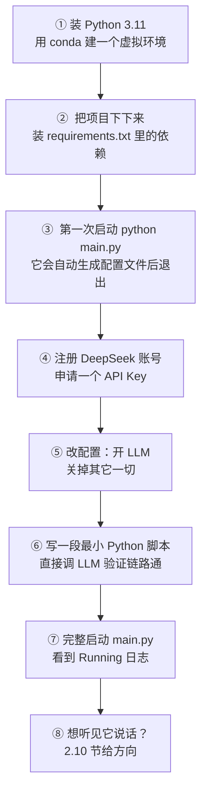


总共 8 步，前 7 步本章带你一步一步做完。第 8 步只给方向，由你自行探索。

每一步之间会有自然的"卡点"——下依赖可能要 5 分钟，申请 API Key 要等账号注册和实名审核。**心理预期请放低**，慢慢来。

---

## 2.3 第一步：装 Python 3.11（用 conda）

### 为什么必须是 Python 3.11？

**必须是 3.11**，不能是 3.10 或 3.12+。

- **不能用 3.10**：项目核心代码（`bot.py`、`services/live_stream/bilibili.py` 等）用了 `asyncio.TaskGroup`——这是 **Python 3.11 才引入的 API**。3.10 跑 main.py 会直接 `ImportError: cannot import name 'TaskGroup' from 'asyncio'`。
- **不能用 3.12+**：项目部分依赖（如 `pyaudio`、`webrtcvad`）还没适配 3.12+ 的 ABI，装依赖会报编译错误。

> 🔍 **代码考古：README 跟代码对不上**
>
> 项目 README 写的是"Python 3.10 或 3.11"，但实际代码用了 3.11 才有的 `TaskGroup`。这是开源项目的常态——**文档比代码更新慢**。本书凡是文档和代码冲突的地方，**一律以代码为准**。如果你后续遇到 README 说能做的事跑不起来，先怀疑文档过时，再去看代码。

如果你已经在电脑上装过 Python 但版本不对（比如装的是 3.9、3.10 或 3.12），不要去卸载——用 conda 建一个 3.11 的"虚拟环境"就行，跟你已有的 Python 互不打架。

### 🆕 新概念：conda 虚拟环境

想象你的电脑是一个公寓，每个 Python 项目都是一个房客。每个房客都需要装一堆自己用的"东西"（依赖库）——比如 A 房客装的是 `requests v1.0`，B 房客需要 `requests v3.0`。如果让他们共用同一个房间，两个版本就会打架。

**虚拟环境**就是"给每个房客单独分一个房间"。你可以装很多个 Python 项目，每个项目有自己独立的依赖，互不影响。

**conda** 是一个非常流行的虚拟环境管理工具，由一家叫 Anaconda 的公司维护。它有两个版本：

- **Anaconda**：完整版，自带 1500 多个常用科学计算库。下载安装包接近 1GB。
- **Miniconda**：精简版，只有 conda 本身和最少必需的包。下载安装包大约 100MB。

**新手推荐 Miniconda**——足够用，不臃肿。

### 下载并安装 Miniconda

去这个网址：[https://docs.conda.io/en/latest/miniconda.html](https://docs.conda.io/en/latest/miniconda.html)

按你的系统下载安装包：

- Windows 选 "Miniconda3 Windows 64-bit"
- macOS 选 "Miniconda3 macOS 64-bit"
- Linux 选 "Miniconda3 Linux 64-bit"

安装时一路下一步即可。Windows 用户在安装时**建议勾选"Add Miniconda3 to my PATH environment variable"**（默认是不勾的，会有红字警告但可以无视）——勾上之后，你在任何命令行窗口都能直接用 `conda` 命令。

> 📎 **小贴士：什么是"PATH 环境变量"？**
>
> 操作系统里有个叫 PATH 的设置，记录了"当你输入一个命令时，去哪些目录里找对应的程序"。把 conda 加入 PATH，就是告诉系统"以后输入 `conda` 命令时，去 Miniconda 安装目录里找它"。否则你必须每次都输入完整路径，比如 `C:\Users\YourName\miniconda3\Scripts\conda.exe`。

### 验证 conda 装好了

打开一个新的命令行窗口（**很重要，旧窗口不会自动加载新的 PATH 设置**），输入：

```bash
conda --version
```

如果你看到类似 `conda 24.5.0` 的输出，说明装好了。如果提示"'conda' 不是内部或外部命令"，说明 PATH 没生效——重启电脑后再试，或者用 Miniconda 自带的 "Anaconda Prompt"（Windows 开始菜单里能搜到）。

### 建一个叫 ZerolanLiveRobot 的虚拟环境

在命令行里输入：

```bash
conda create --name ZerolanLiveRobot python=3.11
```

回车后，conda 会问你 "Proceed ([y]/n)?"，输入 `y` 回车，等它装好。这一步大约耗时 30 秒到 1 分钟，会下载 Python 3.11 解释器和一些基础包。

装完后，**激活**这个环境（"进入这个房间"）：

```bash
conda activate ZerolanLiveRobot
```

激活成功的标志：你的命令行最前面会多出一个 `(ZerolanLiveRobot)` 的标记。比如以前是：

```text
C:\Users\YourName>
```

激活后变成：

```text
(ZerolanLiveRobot) C:\Users\YourName>
```

**只要这个标记在，你就在 ZerolanLiveRobot 这个环境里**。所有后续的 `pip install`、`python` 命令，都只影响这个环境。

如果你以后想退出这个环境（回到默认环境），输入 `conda deactivate`。

> 📎 **小贴士：每次新开命令行都要 activate 吗？**
>
> 是的。conda 环境不是"一次激活永久生效"——你新开一个命令行窗口，默认在 base 环境（conda 自带的默认环境），需要重新 `conda activate ZerolanLiveRobot`。建议你把这条命令记在便签上，因为后面会用很多次。

### 备选方案：用 uv 替代 conda（进阶读者可选）

如果你听说过 **uv** —— 这是 Astral 公司用 Rust 写的新一代 Python 包管理器，2024 年开始流行——你完全可以用它替代 conda。uv 比 conda 快 10–100 倍，越来越多 Python 项目在迁移到它。

用 uv 走完这一步的命令是：

```bash
# 装 uv 本身（一次性，Windows）
powershell -ExecutionPolicy ByPass -c "irm https://astral.sh/uv/install.ps1 | iex"

# 进项目目录后，创建一个 Python 3.11 的 venv
cd D:\dev\ZerolanLiveRobot   # 假设你后面会 clone 到这个目录
uv venv --python 3.11
```

uv 创建的 venv 放在项目目录下的 `.venv/` 文件夹里。**注意四件事**：

1. **不需要也不建议手动 activate**——uv 自己会找到这个 venv。装包用 `uv pip install ...`，跑脚本用 `uv run python ...`。
2. **不要混用 `pip` 和 `uv pip`**——尤其在 git bash / MINGW64 这种 shell 里，裸 `pip` 命令可能装到系统全局 Python 而不是 venv。**统一用 `uv pip`**。
3. **命令行前缀的 `(.venv)` 标记未必可靠**——它只在你显式 activate 了的情况下才显示。如果你想确认当前装包到了哪里，运行 `uv pip install xxx` 时看输出的第一行 `Using Python ... environment at: ...`，那才是真相。
4. **git bash 里写 Windows 路径要小心反斜杠**——`\` 在 bash 里是转义字符，`C:\Work\ai\...` 会被吃成 `C:Workai...`。**要么用双引号包起来 `"C:\Work\ai\..."`，要么用正斜杠 `C:/Work/ai/...`**，否则 uv 会在你完全没料到的地方创建出一个名字很长的奇怪目录。

> 📎 **小贴士：如何确认"我现在跑的 python 到底是哪个"**
>
> 不要看命令行前缀的 `(xxx)` 标记——它可能是历史残留，骗你的。要看就看这两条命令：
>
> ```bash
> where python              # 返回 PATH 第一顺位的 python 路径
> uv run python --version   # uv 视角下当前项目用的 python 版本
> ```
>
> 这两条返回的路径如果都包含你的 venv 目录，说明你确实在 venv 里。如果 `where python` 返回的是 `C:\Users\...\Python310\`，说明 PATH 没指向 venv——这时**永远用 `uv run python ...`** 而不是裸 `python ...`，能避免 99% 的"我环境到底装到哪了"的困惑。

后面 2.4 节我们说 `pip install -r requirements.txt`、`python main.py` 时，**如果你用的是 uv，请脑内自动替换成 `uv pip install -r requirements.txt`、`uv run python main.py`**。其它步骤完全一致。

> 🔍 **代码考古：作者本人推荐用什么？**
>
> 项目 README 里推荐的是 `conda` + `pip`，requirements 也是 `pip` 格式的 `requirements.txt`，没有 `pyproject.toml`。**作者推测**作者本人用的是 conda 工具链。但 uv 也能完美读 `requirements.txt`，所以两边没有冲突，纯属习惯偏好。

---

## 2.4 第二步：把项目下下来，装依赖

### 下载项目

确保你刚才已经 `conda activate ZerolanLiveRobot` 了。然后选一个你喜欢的目录（比如 `D:\dev\`），在那个目录下打开命令行，输入：

```bash
git clone https://github.com/AkagawaTsurunaki/ZerolanLiveRobot.git
cd ZerolanLiveRobot
```

如果你的网络访问 GitHub 有问题，可以试试这些替代方案：

- 用 GitHub Desktop 客户端，它自带网络优化
- 加速代理：把 URL 换成 `https://ghproxy.com/https://github.com/AkagawaTsurunaki/ZerolanLiveRobot.git`
- 实在不行就去 GitHub 网页上点 "Code → Download ZIP"，下完解压

`cd ZerolanLiveRobot` 之后，你的命令行应该是这样：

```text
(ZerolanLiveRobot) D:\dev\ZerolanLiveRobot>
```

`(ZerolanLiveRobot)` 是 conda 环境名，`D:\dev\ZerolanLiveRobot` 是项目目录——两个名字一样只是巧合，别搞混。

### Windows 用户特别注意

项目依赖里有一些"需要本地编译"的库（比如 `pyaudio`）。Windows 上编译 C/C++代码需要装一个叫 **Microsoft Visual C++ Build Tools** 的东西。

去这里下载：[https://visualstudio.microsoft.com/zh-hans/visual-cpp-build-tools/](https://visualstudio.microsoft.com/zh-hans/visual-cpp-build-tools/)

下载后运行安装器，**只勾选 "使用 C++ 的桌面开发"** 这一项就够了。安装完不需要重启。

如果你不装 Build Tools，后面 `pip install` 可能会在装 `pyaudio` 时报错。提前装了省心。

> 📎 **小贴士：那 macOS 和 Linux 用户呢？**
>
> macOS 一般需要装 Xcode Command Line Tools，命令是 `xcode-select --install`。Linux 一般需要装 `build-essential` 和 `portaudio19-dev`（Ubuntu 上 `sudo apt install build-essential portaudio19-dev`）。
>
> 但注意——**第 1 章我们提到过，项目对 Linux 支持不完整**（比如 Live2D 渲染依赖的 `live2d-py` 只在 Windows 上跑）。Linux 用户可以跑核心对话功能，但部分功能受限。

### 装依赖

在项目根目录下（确认你看得到 `requirements.txt` 这个文件），执行：

```bash
pip install -r requirements.txt
```

这一步会装大约 30+ 个 Python 库。**耗时通常 5–15 分钟**，取决于你的网速。

如果某个包卡很久没动，可以 Ctrl+C 取消，然后用国内镜像源加速：

```bash
pip install -r requirements.txt -i https://pypi.tuna.tsinghua.edu.cn/simple
```

如果装到某个包时报错（比如"Microsoft Visual C++ 14.0 or greater is required"），通常意味着你缺 Build Tools——回到上一节装好再重试。

### 验证依赖装好了

随便选几个项目用到的库验证一下：

```bash
pip list | findstr -i "loguru pydantic openai langchain"
```

（如果你在 macOS / Linux 上，把 `findstr -i` 改成 `grep -i`）

你应该看到类似输出：

```text
langchain                 0.x.x
langchain-core            0.x.x
loguru                    0.x.x
openai                    1.x.x
pydantic                  2.x.x
```

只要这几个都在，依赖就装完了。

---

## 2.5 第三步：第一次启动——它会自动生成配置文件并退出

现在你已经具备了"跑这个项目"的最基本条件。我们做一件看起来很奇怪的事——**故意启动它，让它失败**。

为什么？因为项目的设计是这样：

- 它运行需要一份配置文件 `resources/config.yaml`
- 如果这份文件不存在，**它会自动给你生成一份**（带详细注释），然后提示你"请编辑这份文件再重新启动"，最后退出

所以"第一次启动失败"是设计上的预期行为，不是 bug。

### 启动一次试试

在项目根目录下（确认 `main.py` 在你旁边）：

```bash
python main.py
```

如果一切正常，你会在终端里看到类似这样的输出：

```text
2026-05-22 14:32:01.234 | INFO     | manager.config_manager:_check_license:35 - ☺️ License validation passed! Thanks for your support!
2026-05-22 14:32:01.345 | WARNING  | manager.config_manager:generate_config_file:25 - `resources/config.yaml` was not found. I have generated the file for you!
Please edit the config file and re-run the program.
```

然后程序就退出了。这是正常的。

> 📎 **小贴士：如果你看到 `ModuleNotFoundError: No module named 'xxx'`**
>
> 说明依赖装得不全，回到 2.4 节重装。最常见的是 `live2d-py` 在非 Windows 平台装不上——这个不用管，**先用 `pip install -r requirements.txt --ignore-requires-python` 跳过它**，能跑起来就行。

如果你看到 `License validation failed`——说明你不是在项目根目录运行的，或者 `LICENSE` 文件丢了。回到项目根目录重试。

### 看看它给你生成了什么

现在打开你的项目根目录，应该多了一个 `resources/` 文件夹，里面有一个 `config.yaml` 文件。用任何文本编辑器（VS Code、记事本、Notepad++ 都行）打开它。

你会看到一份很长的配置文件，大概几百行，长这样（节选）：

```yaml
##############################################################
# This file was generated at 2026-05-22T14:32:01.345678+00:00 #
##############################################################

# Configuration for the pipeline settings. 
# The pipeline is the key to connecting to `ZerolanCore`, 
# which typically accesses the model via HTTP or HTTPS requests and gets a response from the model. 
# ...
pipeline:
  asr:
    # Whether the pipeline is enabled.
    enable: True
    # The sample rate for audio input.
    sample_rate: 16000
    # ...
  llm:
    # Whether the pipeline is enabled.
    enable: True
    # The API key for accessing the LLM service.
    api_key: None
    # Whether the output format is compatible with OpenAI. 
    openai_format: False
    # The ID of the model used for LLM. 
    model_id: 'THUDM/GLM-4'
    # The URL for LLM prediction requests.
    predict_url: 'http://127.0.0.1:11000/llm/predict'
    # ...
```

### 🆕 新概念：YAML 配置文件

**YAML** 是一种"配置文件格式"，全名 "YAML Ain't Markup Language"（这是个递归式的自嘲名字）。它的设计目标是**对人类友好**——比 JSON 少了一堆引号和大括号，靠"缩进"表示层级。

举个对比，同一份配置用 JSON 写：

```json
{
  "pipeline": {
    "llm": {
      "enable": true,
      "model_id": "deepseek-chat"
    }
  }
}
```

用 YAML 写：

```yaml
pipeline:
  llm:
    enable: true
    model_id: deepseek-chat
```

YAML 短、清爽。代价是**对缩进敏感**——多一个空格少一个空格都可能报错。本项目用的是 2 个空格缩进。

YAML 还支持"行末注释"——以 `#` 开头的内容会被忽略。你看到的 `config.yaml` 里每个配置项上方那些 `# ...` 都是注释，告诉你这个字段是干嘛的。**这些注释不是手写的**，是项目用代码自动从 Pydantic 模型生成的。我们第 5 章和第 6 章会详细讲这套机制。

> 📎 **小贴士：什么是 Pydantic？**
>
> 简单说，**Pydantic** 是一个 Python 库，让你能"用类的方式描述一段数据的形状"——这个字段叫什么、是什么类型、默认值是什么、描述是什么。本项目用 Pydantic 描述了所有配置项，然后让代码自动把 Pydantic 模型转成 YAML、转成 WebUI 表单。你现在看到的 `config.yaml` 就是从 Pydantic "翻译"出来的。
>
> 这只是预告。第 5 章会展开讲整个机制，你现在不用懂细节，只要知道"配置项是怎么来的"就够了。

---

## 2.6 第四步：注册 DeepSeek 账号，申请一个 API Key

现在我们到了选择"用哪个 LLM"的时刻。

### 为什么选 DeepSeek？

项目目前内置支持四种 LLM 来源：


| 来源                         | 形式      | 价格             | 难度  | 备注                   |
| -------------------------- | ------- | -------------- | --- | -------------------- |
| **ZerolanCore（本地）**        | 本机起一个服务 | 免费（用电费 + 你的显卡） | 高   | 需要装第二个项目，需要 12GB+ 显存 |
| **DeepSeek API（云）**        | 调用云端    | 极便宜（充 1 元能用几天） | 低   | OpenAI 格式兼容          |
| **Kimi (Moonshot) API（云）** | 调用云端    | 中等             | 低   | OpenAI 格式兼容          |
| **豆包 (Doubao) API（云）**     | 调用云端    | 中等             | 低   | OpenAI 格式兼容          |


我们选 **DeepSeek API**——理由有四：

1. **便宜得离谱**。它的对话模型 `deepseek-chat` 当前价格大概是 0.001 元/千 tokens——你充值 1 元钱，够你聊几千句。
2. **质量不错**。DeepSeek 是国内做 LLM 比较厉害的公司，他们的对话模型在中文场景下表现很好。
3. **OpenAI 格式兼容**。项目内部支持的"OpenAI 兼容"的 API 都可以无缝替换——你以后想换 Kimi、豆包、OpenAI 都很简单。
4. **国内访问稳定**。不需要科学上网。

> 🤔 **作者推测**：项目作者把 DeepSeek 放进默认支持列表（`pipeline/llm/config.py:13` 的 `LLMModelIdEnum`），且在测试代码（`tests/pipeline/test_llm.py:85`）里也专门为 DeepSeek 写了测试函数——可见作者本人就在用 DeepSeek，这也是为什么我推荐你跟着用。

### 注册并申请 Key

去这个网址：[https://platform.deepseek.com/](https://platform.deepseek.com/)

按页面提示注册账号（用手机号或邮箱都行）。注册完之后：

1. 登录平台
2. 左侧菜单找到"**API Keys**"或"**密钥管理**"
3. 点"创建 API Key"，给它起个名字（随便起，比如 "ZerolanLiveRobot"）
4. 复制生成的 Key，**立即保存到一个安全的地方**——这个 Key 只显示一次，关了页面就再也看不到了

Key 长这个样子（这是个假的，不要拿这个去试）：

```text
sk-abc123def456ghi789jkl012mno345pqr678stu901vwx234yz
```

### 🆕 新概念：API Key

**API Key** 是云服务用来识别"调用者是谁"的字符串。当你的程序向 DeepSeek 发请求时，会在请求头里带上 API Key，DeepSeek 看到 Key 就知道"哦这是谁谁的请求，他账号里有钱，处理一下"。

API Key 的两个铁律：

1. **不要分享给别人**。给别人就等于把你的账户余额送出去了。
2. **不要提交到 GitHub**。哪怕是 private 仓库也别。最好用环境变量或者 `.gitignore` 排除。

本项目把 API Key 直接写在 `config.yaml` 里，而 `config.yaml` 已经在 `.gitignore` 中（你可以打开项目里的 `.gitignore` 看到 `resources/config.yaml` 那行），所以默认不会被你不小心提交上去。

### 充值 1 元钱（可选但建议）

DeepSeek 一般给新用户送一些免费额度，但额度有时效。为了避免"用着用着突然 401"的尴尬，建议你**先充 1 元钱**——足够你跟它聊几千句。

充值入口在平台的"**充值**"或"**财务管理**"页面，支持微信、支付宝。

---

## 2.7 第五步：直接编辑 YAML，开 LLM 关掉其他一切

现在你有了 API Key，下一步是把它写进 `config.yaml`。

> 📎 **小贴士：其实有两种方式改配置**
>
> 项目本身还提供了一个 WebUI（`python webui.py` 启动）让你在浏览器里点点改改，背后用一个叫 **Gradio** 的库渲染。**但我们这一章不用它**——理由有三：
>
> 1. WebUI 自己就是从 `config.yaml` 反向生成出来的，**直接看 YAML 你才知道"配置长什么样"**
> 2. 后面排查问题时，你迟早要回到 YAML 里看一眼，提前熟悉只赚不亏
> 3. WebUI 还需要额外起一个 Gradio 服务，多一个可能卡住的地方
>
> WebUI 背后的"Pydantic 模型 → YAML / WebUI 双向生成"机制非常聪明，我们第 5 章会专门拆开讲。

### 第一步：先看清 YAML 的整体长相

用任何文本编辑器（**强烈推荐 VS Code**，它对 YAML 有语法高亮和括号匹配）打开 `resources/config.yaml`。

把所有内容滑到最顶上，先**只看一级缩进**——你会看到整份配置只有四个顶层节：

```yaml
pipeline:
  ...
service:
  ...
character:
  ...
system:
  ...
```

这四个就是项目的四块配置区，对应到第 1 章我们提过的项目结构：


| 顶层节         | 管什么                                            | 对应代码                          |
| ----------- | ---------------------------------------------- | ----------------------------- |
| `pipeline`  | 所有 AI 模型链路（LLM / ASR / TTS / OCR / 图像描述 / ...） | `pipeline/` 目录                |
| `service`   | 所有对外服务（直播、QQ、游戏、OBS、Live2D ...）                | `services/` 目录                |
| `character` | 角色设定（提示词、TTS 音色样本、对话历史等）                       | `character/` 目录               |
| `system`    | 系统级开关（麦克风快捷键、句子切分、情绪分析等）                       | `config.py` 中的 `SystemConfig` |


**记住这张表**——后面读代码时你会反复用到。

### 第二步：YAML 的三条铁律

直接改 YAML 之前，先记牢三条铁律。这三条犯一条程序就启动不起来，错误信息还经常莫名其妙。

#### 铁律一：缩进必须是空格，绝对不能是 Tab

整份配置用 **2 个空格** 表示一层缩进。VS Code 默认会把你按下的 Tab 自动转成空格，但有些编辑器不会——**养成"敲空格不敲 Tab"的习惯**。

如果你不放心，可以在 VS Code 状态栏右下角看一眼，应该是 "Spaces: 2"，不是 "Tab Size: ..."。

#### 铁律二：冒号后面必须有一个空格

正确：

```yaml
enable: True
```

错误（冒号后没空格，YAML 解析会失败）：

```yaml
enable:True
```

#### 铁律三：本项目生成的 YAML 有自己的小习惯

我们看一下 `common/generator/config_gen.py` 是怎么把 Python 对象写成 YAML 的——它有两个跟通用 YAML 不太一样的小习惯：

```42:42:common/generator/config_gen.py
                    self._yaml_str += self._get_indent(depth) + f"{field_name}: {field_val}\n"
```

- **布尔值首字母大写**：写成 `True` / `False`，不是 `true` / `false`。这是因为代码里直接用了 Python 的 `str(True)`，而 Python 的布尔字符串就是首字母大写。
- **所有字符串值都带单引号**：写成 `model_id: 'deepseek-chat'`，不是裸的 `deepseek-chat`。

> 🤔 **作者推测**：YAML 标准其实接受 `true` / `false` / `True` / `False` 任何一种写法，字符串也不强制要引号。作者这么写大概是"全部加引号 + 全部大写"最不容易踩边界情况坑（比如 `model_id: on` 这种关键字陷阱）。**你修改时也跟着这个习惯走**，最安全。

### 第三步：要改的字段清单

我们要做的事很简单——**只开 LLM，关掉其它所有 AI 链路和所有对外服务**。

下面这张表给你"需要找哪个字段、改成什么值"。表里的"路径"是 YAML 里的层级路径，你可以用编辑器的搜索功能（Ctrl+F）直接搜字段名定位。


| #   | YAML 路径                           | 改成                           | 说明                                |
| --- | --------------------------------- | ---------------------------- | --------------------------------- |
| 1   | `pipeline.asr.enable`             | `False`                      | 关掉语音识别                            |
| 2   | `pipeline.llm.enable`             | `True`（保持）                   | 保持大语言模型开着                         |
| 3   | `pipeline.llm.api_key`            | `'sk-你的真实key'`               | **填你的 DeepSeek Key**              |
| 4   | `pipeline.llm.openai_format`      | `True`                       | 开启 OpenAI 兼容模式                    |
| 5   | `pipeline.llm.model_id`           | `'deepseek-chat'`            | DeepSeek 的对话模型（**自由字符串**，详见下方小贴士） |
| 6   | `pipeline.llm.predict_url`        | `'https://api.deepseek.com'` | DeepSeek API 地址                   |
| 7   | `pipeline.llm.stream_predict_url` | `'https://api.deepseek.com'` | 流式调用也用同一个地址                       |
| 8   | `pipeline.img_cap.enable`         | `False`                      | 关掉图像描述                            |
| 9   | `pipeline.ocr.enable`             | `False`                      | 关掉文字识别                            |
| 10  | `pipeline.vid_cap.enable`         | `False`                      | 关掉视频描述                            |
| 11  | `pipeline.tts.enable`             | `False`                      | 关掉语音合成                            |
| 12  | `pipeline.vla.enable`             | `False`                      | 关掉视觉-语言-行动                        |
| 13  | `pipeline.vec_db.enable`          | `False`                      | 关掉向量数据库                           |
| 14  | `service.live_stream.enable`      | `False`                      | 关掉直播平台接入                          |
| 15  | `service.game.enable`             | `False`                      | 关掉游戏桥接                            |
| 16  | `service.playground.enable`       | `False`                      | 关掉 Unity Playground 桥接            |
| 17  | `service.qqbot.enable`            | `False`                      | 关掉 QQ 机器人                         |
| 18  | `service.obs.enable`              | `False`                      | 关掉 OBS 控制                         |
| 19  | `service.browser.enable`          | `False`                      | 关掉浏览器自动化                          |
| 20  | `service.live2d_viewer.enable`    | `False`                      | 关掉 Live2D 渲染窗口                    |


注意三件事：

- `**service.res_server` 没有 `enable` 字段，所以不在表里**——它是底层基础设施（Flask 文件服务器），项目运行必须依赖它，不能关。你在 YAML 里只会看到 `res_server.host` 和 `res_server.port`。如果默认端口 8899 跟你电脑上别的程序冲突了，把 port 改成一个空闲的（比如 18899）。
- `**system.default_enable_microphone` 不用动**——它默认就是 `False`。你可以搜过去确认一下，加深印象。但这里有个相关字段值得专门看一下：

```yaml
system:
  default_enable_microphone: False
  microphone_vad_mode: 3
  microphone_hotkey: 'f8'
  ...
```

`microphone_hotkey: 'f8'` 这一行告诉你麦克风的开关键是 F8——记住它，2.10 节进阶玩语音的时候用得上。

- `**character` 整段都不用动**——保持默认就行。

### 第四步：实际操作

打开 `resources/config.yaml`，用 Ctrl+F 搜索每个字段名挨个改。

下面我给你三个常见字段的 before / after 对照，帮你确认改对了。

#### 对照一：`pipeline.llm`

**改之前（项目生成的默认值）**：

```yaml
  llm:
    # Whether the pipeline is enabled.
    enable: True
    # The API key for accessing the LLM service.
    api_key: None
    # Whether the output format is compatible with OpenAI.
    openai_format: False
    # The ID of the model used for LLM.
    model_id: 'THUDM/GLM-4'
    # The URL for LLM prediction requests.
    predict_url: 'http://127.0.0.1:11000/llm/predict'
    # The URL for streaming LLM prediction requests.
    stream_predict_url: 'http://127.0.0.1:11000/llm/stream-predict'
```

**改之后**：

```yaml
  llm:
    enable: True
    api_key: 'sk-把这里换成你自己的真实key'
    openai_format: True
    model_id: 'deepseek-chat'
    predict_url: 'https://api.deepseek.com'
    stream_predict_url: 'https://api.deepseek.com'
```

注意：

- 注释（`# ...`）那些行你**可以保留、可以删除**，都不影响程序运行。我上面"改之后"那段是省略了注释方便看
- `api_key` 从 `None` 变成 `'sk-...'`——**必须加单引号**，因为 `sk-xxx` 是字符串
- 缩进保持原样不动（`llm:` 是 1 级缩进，下面的字段是 2 级缩进）

> 📎 **小贴士：`model_id` 是个自由字符串，不是固定选项**
>
> `pipeline.llm.model_id` 这一行不是下拉选项，是**自由文本**——你填什么，项目就把什么字符串原样作为 `model` 参数发给服务商。
>
> 这意味着：
>
> - DeepSeek 出了新模型（比如 `deepseek-v4-pro`、`deepseek-reasoner`），**改 YAML 这一行就能用**，不需要改项目代码
> - 你想换到别的 OpenAI 兼容服务（OpenAI 真身 / 智谱 GLM-4 在线 API / 阿里通义千问 / 千帆 / ...），只要那个服务也是 OpenAI 兼容协议——把 `api_key`、`model_id`、`predict_url`、`stream_predict_url` 四个字段相应改掉就行
>
> 那"我怎么知道某个服务支持哪些 model_id"？去那个服务商的官方文档查——比如 DeepSeek 的当前模型清单在 [https://api-docs.deepseek.com/zh-cn/quick_start/pricing](https://api-docs.deepseek.com/zh-cn/quick_start/pricing)。
>
> `resources/config.yaml` 里 `model_id` 字段上方的注释也会列一份"已知好使的清单"（项目代码里维护的参考清单），新手不知道填什么时可以照着抄。
>
> 这一章我们就**保持简单用 `deepseek-chat`**——它是 DeepSeek 提供的"通用对话别名"，背后会跟着 DeepSeek 的版本升级自动指向他们当前主推的通用对话模型，对新手最省心。等你跑通整条链路，再去试 `deepseek-v4-pro` 这种带"思考模式"的新模型也不迟（不过那些新模型的高级参数比如 `reasoning_effort` 当前项目还不支持，未来章节再聊扩展点）。

#### 对照二：`pipeline.asr`（关掉的样子）

只改 `enable` 一个字段就够了，其它字段全部不用动：

```yaml
  asr:
    enable: False     # ← 从 True 改成 False，其它字段不用动
    sample_rate: 16000
    channels: 1
    format: 'float32'
    model_id: 'iic/speech_paraformer_asr_nat-zh-cn-16k-common-vocab8358-tensorflow1'
    # ... 后面的字段保持默认 ...
```

**关掉一个 pipeline 时，只改它的 `enable` 字段就行**——其它字段是关掉时被忽略的"死参数"。这是个简单但重要的规律。

#### 对照三：`service.live_stream`（关掉的样子）

```yaml
  live_stream:
    enable: False     # ← 外层主开关，必改
    bilibili:
      enable: False   # ← 内层开关，也建议改成 False
      room_id: -1
      ...
    twitch:
      enable: False   # ← 同上
      ...
    youtube:
      enable: False   # ← 同上
      ...
```

> 📎 **小贴士：内层 enable 在代码层面"外层关了就不会被读"，但仍然建议显式改成 False**
>
> 查 `framework/context.py:112` 的代码可以看到：
>
> ```python
> if _config.service.live_stream.enable:
>     if _config.service.live_stream.bilibili.enable:
>         self.bilibili = BilibiliService(...)
> ```
>
> 严格来说，**只要外层 `live_stream.enable` 是 False，内层 `bilibili.enable` 是 True 还是 False 都不会被实例化**——代码逻辑没问题。
>
> 但对新手来说，"两层都改"是更稳的习惯，原因有三：
>
> 1. **防漏改外层**——人脑容易漏行，如果只指望"外层关就行"，万一你漏改了外层就会炸（典型症状：`AssertionError: Room id must be greater than 0`，因为 `BilibiliService` 会校验 `room_id > 0`）。
> 2. **防代码改动**——以后作者重构代码、去掉外层 if，你的配置就裸奔了。
> 3. **配置文件读起来更直观**——一眼看到 `bilibili.enable: False` 就知道这个服务是关的，不需要在脑子里跑一遍"外层是不是关了"的判断。
>
> 这是个广泛存在的原则：**显式优于隐式**——配置文件里能说清楚的就别让人推理。Python 的设计哲学 PEP 20 第二条就是 "Explicit is better than implicit"。

### 第五步：保存并自检

改完之后**保存文件**（Ctrl+S）。然后用一个最快的方法自检一下"YAML 格式有没有写坏"——在命令行里执行：

```bash
python -c "from manager.config_manager import get_config; c = get_config(); print('LLM model:', c.pipeline.llm.model_id.value); print('ASR enabled:', c.pipeline.asr.enable)"
```

如果你看到类似输出：

```text
LLM model: deepseek-chat
ASR enabled: False
```

说明 YAML 解析通过、字段也读对了。

如果你看到 `yaml.scanner.ScannerError` 或 `yaml.parser.ParserError`——说明 YAML 格式坏了。常见原因：

- 不小心删了某行的冒号
- 缩进多了 / 少了空格
- 字符串值没加单引号但里面有特殊字符

**直接报错信息会告诉你大概在第几行**，去那一行附近看一下。实在搞不定就**删掉 `resources/config.yaml`，重新跑 `python main.py` 让它重新生成一份默认值**，然后再改。

### 第六步：备份一下

改完且自检通过之后，**复制一份 `config.yaml` 改名为 `config.yaml.bak` 备份起来**——后面你折腾配置时改坏了，回滚成本就只有"复制粘贴"。

---

## 2.8 第六步：写一段最短的 Python 脚本，直接验证 LLM 通了

在跑完整的 `main.py` 之前，我们先做一个"局部测试"——只跑 LLM 这一段，看 DeepSeek 那边能不能调通。

**为什么先单独测**？因为完整的 `main.py` 启动失败原因有几十种（端口被占、麦克风设备不识别、依赖版本不对……），如果直接跑你不知道是哪里挂了。单独测 LLM，你能 100% 确定"我的 API Key 是对的、我的网络能连 DeepSeek、我的项目能调用 LLM Pipeline"。这三件事一旦确认，后续问题就好排查多了。

### 新建测试脚本

在项目根目录下新建一个文件叫 `quick_test.py`，把下面的代码原样复制进去：

```python
from zerolan.data.pipeline.llm import LLMQuery
from manager.config_manager import get_config
from pipeline.llm.llm_sync import LLMSyncPipeline

config = get_config()
llm = LLMSyncPipeline(config.pipeline.llm)

query = LLMQuery(text="你好，请用一句话介绍你自己。", history=[])
prediction = llm.predict(query)

print("=" * 40)
print("LLM 的回复是：")
print(prediction.response)
print("=" * 40)
```

逐行解释：

- 前 3 行是导入。`LLMQuery` 是发给 LLM 的"问题对象"；`get_config()` 加载你刚才保存的配置；`LLMSyncPipeline` 是项目里调 LLM 的封装。
- 第 5 行加载配置，第 6 行用 LLM 配置构造一个"LLM 调用器"。
- `LLMQuery(text=..., history=[])` 构造一次问话——`text` 是你这次说的话，`history` 是历史对话（这里是空，因为是第一次说）。
- `llm.predict(query)` 是真正的调用——它会把你的问题发给 DeepSeek，等返回，然后包成 `LLMPrediction` 对象返回。
- 最后三行打印。

### 跑一下

在命令行（保持 conda 环境激活、在项目根目录）：

```bash
python quick_test.py
```

如果一切正常，你会看到几行日志（loguru 的输出），然后看到 LLM 的回复。比如：

```text
========================================
LLM 的回复是：
你好！我是 DeepSeek 开发的 AI 助手，可以陪你聊天、回答问题、帮你解决各种任务。
========================================
```

**如果你看到了这段输出——恭喜你，项目的"大脑"在你电脑上跑通了**。

### 常见报错排查

如果没成功，按照下面这张表排查：


| 报错关键字                                                  | 原因              | 解决                                                                       |
| ------------------------------------------------------ | --------------- | ------------------------------------------------------------------------ |
| `Incorrect API key provided`                           | API Key 错或者还没生效 | 检查 `config.yaml` 里的 `api_key` 是不是真实的 Key，不是 `None` 或 `'sk-xxx...'` 这种占位符 |
| `Insufficient Balance`                                 | DeepSeek 账户余额不够 | 去 DeepSeek 平台充值                                                          |
| `Connection error` / `ConnectionError`                 | 网络不通            | 试试 `curl https://api.deepseek.com`，如果连不通就是网络问题                           |
| `ModuleNotFoundError: No module named 'zerolan'`       | 依赖没装全           | 回到 2.4 重装 `requirements.txt`                                             |
| `AssertionError: At least LLMPipeline must be enabled` | 你把 LLM 也关了      | 回到 WebUI 把 `pipeline.llm.enable` 勾上                                      |


排查完再跑一次。直到你看到 "LLM 的回复是：..."。

---

## 2.9 第七步：完整启动 main.py，看运行日志

单独测试通了之后，我们终于可以启动完整程序了。

### 启动

```bash
python main.py
```

这次你会看到比第一次多得多的输出。重点关注以下几行：

```text
2026-05-22 14:55:01.234 | INFO     | manager.config_manager:_check_license:35 - ☺️ License validation passed!
... (一大堆 INFO 日志，记录每个模块的初始化) ...
2026-05-22 14:55:03.456 | INFO     | bot:__init__:54 - 🤖 Zerolan Live Robot: Initialized services successfully.
2026-05-22 14:55:03.567 | INFO     | bot:start:57 - 🤖 Zerolan Live Robot: Running...
2026-05-22 14:55:03.678 | INFO     | event.event_emitter:start:194 - TypedEventEmitter is running...
```

看到 `🤖 Zerolan Live Robot: Running...` 表示**主程序已经成功启动**。

之后程序会一直运行——你会看到每秒一行的"心跳"日志（来自第 1 章我们提到过的 1 Hz 心跳），还有 Flask 的 `ResourceServer` 启动日志（监听某个端口）。

如果你的命令行一直在打日志、不退出，说明它正在"等待事件发生"——但因为我们关掉了麦克风、关掉了所有 Service，所以**它现在没事可做**。它不会主动跟你说话——这是预期行为。

> ⚠️ **如果你看不到 `Running...`，请先看下面的"实战记录"** —— 在我们写这本书的过程中，作者本人按 2.7 节的"最小化配置"跑 `main.py` 一共踩了 6 个连续的坑才看到这一行。**这些坑不是你犯的错，是项目当前的真实状态**。

### 实战记录：本书作者第一次跑 main.py 踩过的 6 个坑（按出现顺序）

这一节我把作者本人在写本书时跑 `main.py` 踩到的全部错误**按真实顺序**记录下来，包括每个错误的根因、解决方案、以及我从中学到的元教训。**这段内容比"常见报错排查"那张表更长，但每一个都是真实发生过的**——你大概率会按同样的顺序踩到至少其中几个，提前知道能少走不少弯路。

#### 坑 1：`ModuleNotFoundError: No module named 'pkg_resources'`

第一次 `python main.py` 启动后立刻报：

```text
File "C:\...\webrtcvad.py", line 1, in <module>
    import pkg_resources
ModuleNotFoundError: No module named 'pkg_resources'
```

**根因**：`webrtcvad`（语音端点检测库）在 `import` 时用了 `pkg_resources`，而它是 `setuptools` 包的一部分。**Setuptools 70+ 把 `pkg_resources` 剥离出去了**——新装的 setuptools 默认不带这个 API。

**解决**：

```bash
uv pip install "setuptools<70"
```

**注意**：不要 `--upgrade` 升级。我最初给的建议是 `pip install --upgrade setuptools`，结果装到了 82.0.1——这个版本就是不带 `pkg_resources` 的，所以"升级"反而把问题钉死了。**降级到 69.x 才解决**。

> 📎 **元教训**：遇到 `ModuleNotFoundError`，不能反射式地"升级 setuptools"——要先搞清楚这个模块在哪个版本被移除了，然后定向锁定旧版本。

#### 坑 2：`pip` 装到了系统全局 Python，不是 venv

跟坑 1 叠在一起的暗坑——我用 git bash + uv 建的 venv，然后跑 `pip install --upgrade setuptools`，输出是这样：

```text
Requirement already satisfied: setuptools in c:\users\dlyx2\appdata\local\programs\python\python310\lib\site-packages
```

**注意路径里的 `Programs\Python\Python310\`**——这是**系统全局 Python**，不是 venv。换句话说，我装的包根本没进 venv。

**根因**：git bash (MINGW64) 不会正确执行 uv venv 的 Windows 风格 activate 脚本——所以**命令行前缀那个 `(ZerolanLiveRobotEnv)` 是历史残留**，骗人的。PATH 里的 `pip` 实际指向系统全局 Python。

**解决**：在 uv 项目里**永远用 `uv pip` 而不是裸 `pip`**：

```bash
uv pip install "setuptools<70"   # 永远带 uv 前缀
```

输出里第一行 `Using Python ... environment at: ...` 才告诉你"这次装到了哪"。

> 📎 **元教训**：命令行前缀的 `(.venv)` 标记不可靠，**用 `where python` 或者 `uv run python --version` 验证当前 Python 真正指向哪里**。不要被前缀骗了。

#### 坑 3：`ImportError: cannot import name 'TaskGroup' from 'asyncio'`

第二次启动炸在：

```text
File "C:\...\services\live_stream\bilibili.py", line 1, in <module>
    from asyncio import TaskGroup, Queue
ImportError: cannot import name 'TaskGroup' from 'asyncio'
```

**根因**：`asyncio.TaskGroup` 是 **Python 3.11 引入的新 API**，Python 3.10 没有。而 uv 默认用了系统现有的 Python 3.10。

**解决**：重建 venv 到 3.11：

```bash
uv venv --python 3.11 --force
uv pip install -r requirements.txt
uv pip install "setuptools<70"
```

> 📎 **元教训**：项目 README 写的"Python 3.10 或 3.11"是错的（**README 比代码更新慢**，这是开源项目的常态）。**永远以代码为准**——这本书的写作过程中，我也是踩了这个坑才把第 1 章 1.5 节和第 2 章 2.3 节的版本要求修正成"必须 3.11"。

#### 坑 4：路径反斜杠被 git bash 吃掉

修坑 3 时，我让用户跑：

```bash
uv venv C:\Work\ai\ZerolanLiveRobot_runningEnv\ZerolanLiveRobotEnv --python 3.11 --force
```

uv 的输出显示：

```text
Creating virtual environment at: C:WorkaiZerolanLiveRobot_runningEnvZerolanLiveRobotEnv
```

**反斜杠全没了**——uv 在当前目录下创建了一个名字长得离谱的奇怪目录。

**根因**：git bash 里 `\` 是转义字符，`\W`、`\a`、`\Z` 这些被 bash 在传给 uv 之前就吃掉了。

**解决**：3 种 git bash 安全写 Windows 路径的方法：

```bash
# 方法 A：用双引号包路径
uv venv "C:\Work\ai\ZerolanLiveRobot_runningEnv\ZerolanLiveRobotEnv" --python 3.11 --force
# 方法 B：用正斜杠
uv venv C:/Work/ai/ZerolanLiveRobot_runningEnv/ZerolanLiveRobotEnv --python 3.11 --force
# 方法 C（推荐）：用项目本地 .venv
cd /c/Work/ai/ZerolanLiveRobot && uv venv --python 3.11 --force
```

> 📎 **元教训**：跨 shell 的路径处理是工程史上的"祖传重灾区"。**当你看到工具的输出路径里少了点东西、多了点东西，先怀疑是 shell 在搞事，再怀疑工具**。

#### 坑 5：`AssertionError: Room id must be greater than 0`

跨过 import 阶段后，进入真正的初始化，炸在：

```text
File "C:\...\services\live_stream\bilibili.py", line 25, in __init__
    assert config.room_id and config.room_id > 0, "Room id must be greater than 0"
AssertionError: Room id must be greater than 0
```

traceback 里的局部变量显示：

```text
LiveStreamConfig(enable=True, bilibili=BilibiliServiceConfig(enable=True, room_id=-1, ...))
```

**根因**：`config.yaml` 里 `service.live_stream.enable` 还是 `True`，`bilibili.enable` 也是 `True`，但 `room_id` 是默认值 `-1`。`BilibiliService.__init__` 第一行就断言 `room_id > 0`，所以炸。

**解决**：打开 `resources/config.yaml`，把 `service` 整段下所有的 `enable` 都改成 `False`（**除了 `res_server` 不要动**）。完整清单见 2.7 节的对照表。

> 📎 **元教训**：本书最初版本的 2.7 节有句小贴士说"外层关了，内层不用关"——查代码这是对的（`context.py:112` 有外层 if），但**配置漏改外层时，内层 `enable=True` 的服务会直接被实例化并炸**。**显式优于隐式**——配置里两层都改成 False，最稳。

#### 坑 6：`AttributeError: 'NoneType' object has no attribute 'set_lang'`（这是项目代码 bug）

闯过前 5 关后，又炸在：

```text
File "C:\...\bot.py", line 46, in __init__
    self.tts_prompt_manager.set_lang(self.cur_lang)
AttributeError: 'NoneType' object has no attribute 'set_lang'
```

**根因**：这是项目代码层面的一个**真实 bug**：

- `framework/context.py:54` 把 `self.tts_prompt_manager` 初始化为 `None`
- `framework/context.py:95-97` 只在 `pipeline.tts.enable = True` 时才实例化它
- 但 `bot.py:46` **无条件**调用 `self.tts_prompt_manager.set_lang(...)`——所以**关掉 TTS 后必崩**

这意味着——**项目代码实际上不支持"只开 LLM 关掉 TTS"的最小化配置**。READIME 暗示 pipeline 可以选择性启用，但代码当前不支持。

**解决**：三选一（我选了 B）：

- **A. 哲学解决**：承认 2.8 节 `quick_test.py` 已经完成了"让它回第一句话"的核心目标——直接进入下一章
- **B. 最小 patch**：改 `bot.py` 两行加 `None` 兜底（见下面 patch）
- **C. 正经路线**：把 TTS 也配齐（百度 TTS + 准备 wav 文件，见 2.10 节）

**Patch 内容**（应用到本地 `bot.py`，**不要 commit**）：

```python
# bot.py:46 附近（__init__ 里）
# 原：
        self.tts_prompt_manager.set_lang(self.cur_lang)
# 改成：
        if self.tts_prompt_manager is not None:
            self.tts_prompt_manager.set_lang(self.cur_lang)

# bot.py:492 附近（change_lang 里）
# 同样的两行修改
```

改完用 `git diff bot.py` 确认改动干净（只增加了 2 处 `if not None` 兜底），不要 commit。如果以后想 `git pull` 上游代码：

```bash
git stash               # 暂存你的 patch
git pull
git stash pop           # 把 patch 重新应用回来
```

> 📎 **元教训**：开源项目中"作者本人没踩过的路径"经常有未发现的 bug——这次的 bug 之所以一直没被作者发现，多半因为作者本人开发时 TTS 总是开着的，根本不会触发"`tts_prompt_manager = None` 然后被调用"这条路径。**当你尝试一个"作者没明示支持但理论上应该支持"的配置组合时，要做好踩 bug 的心理准备**——这反而是开源世界里贡献价值的好机会（可以提 issue 或 PR 修这个 bug）。

#### 总结：6 个坑横跨的层次


| 坑                                  | 属于哪个层次      | 教训                         |
| ---------------------------------- | ----------- | -------------------------- |
| 1. setuptools 70+ 移除 pkg_resources | Python 生态变化 | 不要反射式 upgrade，要查变更日志       |
| 2. pip 装到全局 Python                 | 工具链不一致      | 用 `uv pip`、`uv run python` |
| 3. Python 3.10 缺 TaskGroup         | 文档过时        | 以代码为准，不信 README            |
| 4. 路径反斜杠被吃                         | shell 行为差异  | 跨 shell 路径用引号或正斜杠          |
| 5. service 配置漏改                    | 配置不显式       | 显式优于隐式                     |
| 6. bot.py 调 None                   | 项目代码 bug    | "未走过的路径"经常有未发现的 bug        |


**这 6 个坑横跨了 Python 生态、工具链、shell、文档、配置、项目代码六个完全不同的层次**——每一个都不是项目本身的问题，但每一个都会卡新手好几个小时。在你后面读代码的过程中，**遇到任何"按文档做但跑不通"的情况，第一反应应该是"是不是上面这六类问题之一"**，而不是怀疑自己。

---

### 验证它真的在运行

启动成功后，你的电脑上其实有**三个网络服务**同时在跑——不只一个。可以这样验证：


| 端口                                     | 是什么                                                     | 怎么验证                                                          |
| -------------------------------------- | ------------------------------------------------------- | ------------------------------------------------------------- |
| `**service.res_server.port`**（默认 8899） | Flask `ResourceServer`，用于资源文件托管                         | 浏览器打开 `http://127.0.0.1:8899/`，看到 Flask 404 页面就行（能访问到说明服务在运行） |
| **7861**（或 7860 / 7862...）             | Gradio 配置 WebUI——**main.py 自带，不需要单独 `python webui.py`** | 浏览器打开日志里那个 `http://127.0.0.1:786X` 的链接，看到配置界面就行               |
| 后台无端口                                  | `TypedEventEmitter` 事件总线                                | 看日志里 `TypedEventEmitter is running...` 那一行                    |


> 🤔 **作者推测：为什么 main.py 也起 WebUI？**
>
> 看 `framework/context.py:140` 的 `self.config_page = DynamicConfigPage(_config)` 就明白了——`DynamicConfigPage` 是**无条件创建**的，并且在 `bot.start()` 里会被 `.launch()`。意味着 main.py 既是机器人主进程，**又**是配置 WebUI 的宿主。
>
> 这样设计的好处是：你跑机器人时随时可以打开 WebUI 改配置；坏处是配置改了不会自动"热重载"到运行中的对象上——具体行为我们留到第 5 / 6 章讲 Pydantic 配置系统时再展开。

你也可以再开一个命令行窗口（用 uv 的：`cd 到项目目录`；用 conda 的：`conda activate xxx`），重新跑一遍 `python quick_test.py`——能跑出 LLM 回复，证明 LLM 链路也在 main.py 进程里活着。

### 常见报错排查

完整启动比 2.8 节的单测复杂得多——它会一次性把所有模块都初始化一遍。任何一个模块初始化失败，整个程序就起不来。下面这张表收录了**实战中真实遇到过**的几种典型报错：


| 报错关键字                                                                  | 在哪个模块炸                                        | 原因                                                                                                                                                  | 解决                                                                                                                                                    |
| ---------------------------------------------------------------------- | --------------------------------------------- | --------------------------------------------------------------------------------------------------------------------------------------------------- | ----------------------------------------------------------------------------------------------------------------------------------------------------- |
| `ModuleNotFoundError: No module named 'pkg_resources'`                 | `devices/microphone.py` → `import webrtcvad`  | `webrtcvad` 在 `import` 时用了 `pkg_resources`——这个模块以前由 `setuptools` 提供，但 **setuptools 70+ 把它剥离出去了**，新装的 setuptools 默认不带这个 API                          | **直接降级**：`pip install "setuptools<70"`（或 `uv pip install "setuptools<70"`，看你用哪个包管理器）。注意不要 `--upgrade` 升级，那只会越升越没                                      |
| `ImportError: cannot import name 'TaskGroup' from 'asyncio'`           | `services/live_stream/bilibili.py` 或 `bot.py` | 你的 Python 是 **3.10 或更低**，但项目用了 3.11 才引入的 `asyncio.TaskGroup`                                                                                        | 把 venv 重建成 3.11：`uv venv --python 3.11 --force` 然后 `uv pip install -r requirements.txt` 重装依赖。用 conda 的就 `conda create -n NewEnv python=3.11` 重来一遍     |
| `AssertionError: Room id must be greater than 0`                       | `services/live_stream/bilibili.py:25`         | 你 `config.yaml` 里 `service.live_stream.enable` 还是 `True`，且 `bilibili.enable` 也是 `True`，但 `room_id` 是默认值 -1，BilibiliService 初始化时被断言挡了                | 打开 `resources/config.yaml`，把 `service.live_stream.enable` 改成 `False`，顺手把 `service.live_stream.bilibili.enable` 也改成 `False`（显式优于隐式）。重启                 |
| 类似的 `xxx must be greater than 0` / `xxx is required` 等 service 初始化断言失败 | `services/*/...py:__init__`                   | 同上，对应 service 的 `enable` 是 True 但必填字段没填                                                                                                             | 回到 2.7 节的"关掉所有 service"清单，逐条对照 `config.yaml`，把所有 `service.*.enable` 都改成 `False`（除了 `res_server` 不要动）                                                  |
| `AttributeError: 'NoneType' object has no attribute 'set_lang'`        | `bot.py:46`                                   | **项目代码已知现象**：`tts_prompt_manager` 只在 `pipeline.tts.enable = True` 时被实例化（见 `framework/context.py:95`），但 `bot.py:46` 无条件调用它。**这意味着关掉 TTS 时项目实际上启动不了** | 三选一：（1）接受"2.8 节的 quick_test.py 已经完成了'让它回第一句话'的目标"，直接跳到下一章；（2）改 `bot.py:46` 加一层 `if self.tts_prompt_manager is not None:` 兜底；（3）把 TTS 真正配上（见 2.10 节地图） |


> 🔍 **代码考古：项目代码实际上不支持"只开 LLM 关掉 TTS"的最小化配置**
>
> 这是一个真实的代码现象，值得单独拎出来讲：
>
> - `framework/context.py:54` 把 `tts_prompt_manager` 默认为 `None`
> - `framework/context.py:95-97` 只在 TTS 启用时才实例化它
> - 但 `bot.py:46` **无条件**调用 `self.tts_prompt_manager.set_lang(...)`
>
> 三段代码合起来等于："你必须启用 TTS，否则 `ZerolanLiveRobot.__init__()` 第一步就崩"。这跟项目 README 暗示的"你可以选择性启用各 pipeline"是有矛盾的——README 描述的是设计意图，代码描述的是当前真实状态。
>
> **作者推测**：作者本人的开发场景里 TTS 几乎总是开启的，所以这条空指针路径长期没被触发到，也就一直没被修。
>
> 这是开源项目"代码 > 文档"原则的又一个例子——**你只能信代码，不能信文档**。本书的写作过程中也是这样：很多章节都是我先信了 README，后来跑代码时才发现描述不对，再回头修正。如果你以后自己读其他开源项目，养成"读文档建立大方向 → 跑代码验证 → 不一致时一律以代码为准"的习惯，会少踩很多坑。
> | `Couldn't find ffmpeg or avconv`（**警告**，不是报错） | `pydub` 库初始化 | 系统里没装 ffmpeg 命令行工具，pydub 转音频格式时会用它 | 现在跑文字对话**不影响**；准备扩展语音时再装：Windows 用 `winget install ffmpeg` 或 `choco install ffmpeg`，装完**新开命令行**让 PATH 生效 |
> | `ModuleNotFoundError: No module named 'live2d'` 或类似 | `framework/context.py` 初始化 Live2D 相关 | `live2d-py` 这个库只在 Windows 上能装 | 如果你在 macOS/Linux，跳过这个库：`pip install -r requirements.txt --no-deps live2d-py` 或直接编辑 requirements 去掉它；Live2D 功能会失效但不影响对话 |
> | `OSError: [Errno -9996] Invalid input device` 或 `pyaudio` 相关 | `SmartMicrophone` 初始化 | 系统找不到默认音频输入设备（没插麦克风 / 麦克风被独占 / 驱动有问题） | 检查系统设置里"默认输入设备"是否存在并被识别；插上麦克风重试；实在不行先在 `config.yaml` 里设 `system.default_enable_microphone: False`（**但 `SmartMicrophone` 对象仍会创建**，所以这只是规避使用问题，根因还是设备问题） |
> | `Address already in use` / `端口 xxx 已被占用` | `ResourceServer`（Flask）启动 | 配置文件里指定的端口被别的程序占了 | 改 `service.res_server.port` 为另一个端口（比如 5000、8000、9000 都行）；或者用 `netstat -ano \| findstr :端口号` 找出谁占了把它关掉 |
> | `AssertionError: At least LLMPipeline must be enabled` | `framework/context.py:82` | 你不小心把 `pipeline.llm.enable` 改成了 `False` | 改回 `True` 重启 |

> 📎 **小贴士：怎么从 traceback 里快速定位是哪个模块炸**
>
> 报错的 traceback 是从最外层调用一层层往内打印的——**最下面一行（`File "..."` 后跟着的报错文本）才是真正炸的地方**。比如上面表格里第一行的报错，traceback 最底下是 `webrtcvad.py", line 1, in <module>`，往上一层是 `microphone.py`——一眼就能定位是"麦克风模块导入 webrtcvad 时炸了"。
>
> 这条排查习惯对所有 Python 项目都通用，不限于本项目。

### 关闭

回到 main.py 运行的那个命令行窗口，**按 Ctrl+C**。你会看到：

```text
2026-05-22 14:58:01.234 | INFO     | bot:stop:127 - Good Bye!
```

正常退出。

> 🔍 **代码考古：Ctrl+C 退出有时不干净**
>
> 你可能会发现按 Ctrl+C 之后程序退不干净，或者退出时打了一堆异常 traceback。**这跟项目里 `KillableThread`（强杀线程）的实现有关**——它在退出时会粗暴地终止所有线程，有些线程正在 IO 中会留下异常。这不是 bug，是有意为之的设计取舍。我们第 4 章和第 8 章会详细讨论这件事。
>
> 如果 Ctrl+C 真的杀不死，**直接关闭命令行窗口**或者用任务管理器 kill Python 进程，没事。

---

## 2.10 第八步：想听见它说话？这里是地图

到 2.9 节为止，你已经做到了"程序能跑 + LLM 链路通"。但你还没听见它说话——因为我们把麦克风、ASR、TTS 全关了。

在我们逐项列出"还差什么"之前，先放大一下镜头——**你跑起来的这个 ZerolanLiveRobot，其实只是一个更大生态里的一块拼图**。理解整个生态有 5 块拼图、各自负责什么，你就知道往后要装什么、不装什么、为什么这样切。

### Zerolan 项目家族：5 个仓库的分工

作者 **AkagawaTsurunaki** 把"做一个 AI 主播"这件事**横切**成了 5 个独立仓库——每个仓库职责单一、可独立部署、用网络协议互连。这种切法在工程上叫 **微服务架构 / 多仓库（polyrepo）**——好处是每块都可以单独维护和发布，坏处是新手第一次接触会被"怎么这么多东西"吓到。

下面这张表，把这 5 个仓库一次性说清楚：


| 仓库                                                                               | 一句话职责（README 原话）                                                | 你什么时候会接触到                                                                                                                                           |
| -------------------------------------------------------------------------------- | --------------------------------------------------------------- | --------------------------------------------------------------------------------------------------------------------------------------------------- |
| **[ZerolanLiveRobot](https://github.com/AkagawaTsurunaki/ZerolanLiveRobot)**     | 直播机器人的控制框架，通过采集各类数据，并综合分析做出动作响应                                 | **就是本书的主角**——你已经在跑了                                                                                                                                 |
| **[ZerolanCore](https://github.com/AkagawaTsurunaki/zerolan-core)**              | 为直播机器人提供 AI 推理服务的核心模块（LLM / ASR / TTS / OCR / 图说 等的 Web API 服务） | 如果你想**在本地跑 AI 模型**（不用云端 API），你需要装它                                                                                                                  |
| **[ZerolanData](https://github.com/AkagawaTsurunaki/zerolan-data)**              | 定义了各个项目或服务之间沟通与交换的数据格式                                          | **你已经在用了**——你 `requirements.txt` 第 3 行装的就是它（`zerolan-data==1.5.0`）。第 2.8 节 `quick_test.py` 里 `from zerolan.data.pipeline.llm import LLMQuery` 用的就是它 |
| **[ZerolanPlayground](https://github.com/AkagawaTsurunaki/ZerolanPlayground)**   | 使用 Unity 引擎和 Vuforia 引擎开发的 AR 虚拟形象展示器，兼容 Live2D 模型的展示           | 如果你想要 **3D 虚拟形象 / 手机 AR** 效果，下载它的发布版即可（一个独立 Unity 应用）                                                                                               |
| **[KonekoMinecraftBot](https://github.com/AkagawaTsurunaki/KonekoMinecraftBot)** | 基于 mineflayer 的 Minecraft 智能体，使用有限状态机控制行为（打怪、砍树、睡觉等），支持语音控制     | 如果你想让她**操纵 Minecraft 里的角色**，下载并连接它                                                                                                                  |


这 5 块拼图之间的关系，画成图是这样的：

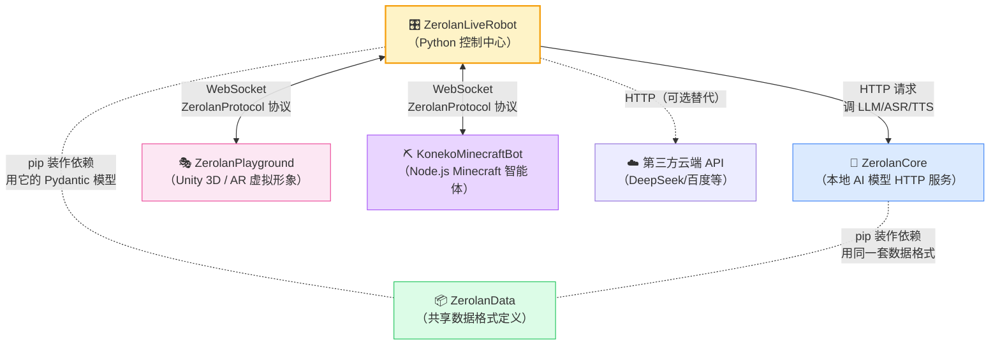


**读这张图的三个关键观察**：

1. **ZerolanData 是"契约层"**——它本身不做任何业务，只定义"消息长什么样"。其它两个 Python 仓库（ZerolanLiveRobot 和 ZerolanCore）都 `pip install` 它作为共同依赖。这样一边发请求、一边收请求时，两边对**字段叫什么、是什么类型**有共同认知，不会鸡同鸭讲。**你在第 2.8 节的 `quick_test.py` 里写的 `LLMQuery(text=..., history=[])`，就是 ZerolanData 定义的数据形状**——这就是为什么 ZerolanCore 那边收到这个请求能正确解析。
2. **ZerolanCore 是可选的"本地大脑供应商"**——你不装它，照样可以跑（第 2 章我们就是这么做的，全部走 DeepSeek 云端 API）。**作者推测**：作者把推理服务**单独拆一个仓库**，是为了让有显卡的用户能本地跑模型、没显卡的用户走云端 API——同一个 ZerolanLiveRobot 在两边都能用。
3. **ZerolanPlayground 和 KonekoMinecraftBot 用了一套自创的协议叫 ZerolanProtocol**——本质是套在 WebSocket 上的 JSON 消息格式。**第 11 章会详讲这套协议**——你现在只需要知道"它们之间通过 WebSocket 说话"。

> 🤔 **作者推测：为什么 Minecraft 智能体用 Node.js 而不是 Python？**
>
> 因为操控 Minecraft 客户端的事实标准库叫 **mineflayer**——它是 JavaScript 写的、生态最完整。**作者推测**：作者面对"用 Python 重新实现一个 mineflayer" vs "用 Node.js 写一个独立仓库通过 WebSocket 连到 Python 主程序" 这两个选择时，理性地选了后者。这就是为什么 5 个仓库里有一个不是 Python——**用合适的语言做合适的事，比强求统一更工程**。

> 📎 **本书的覆盖范围**
>
> 这本书的主角是 **ZerolanLiveRobot**——你正在跑的这个仓库。**ZerolanData** 会在第 5 章（Pydantic 与配置体系）和第 6 章（Pipeline）反复出现。**ZerolanCore / ZerolanPlayground / KonekoMinecraftBot** 会在第 10 章（外部服务集成）和第 11 章（跨进程通信）作为"对方"被提到——但不会详讲它们各自的内部实现（每一个都够单独写一本书）。

理解了这张全景图，下面我们再列"为了听见她说话，你具体要补哪些拼图"——

### 需要补的拼图


| 拼图                     | 你要做的事                                                                                   | 难度    |
| ---------------------- | --------------------------------------------------------------------------------------- | ----- |
| **打开麦克风**              | 把 `system.default_enable_microphone` 勾上，把 `system.microphone_hotkey` 设成你喜欢的按键（默认是 `f8`） | 🟢 简单 |
| **配 ASR**（语音→文字）       | 选一种 ASR 来源，填配置                                                                          | 🟡 中等 |
| **配 TTS**（文字→语音）       | 选一种 TTS 来源，填配置                                                                          | 🟡 中等 |
| **准备 TTS 音色样本**        | 项目用的是 GPT-SoVITS（如果走 ZerolanCore），需要你录一段 5–10 秒的参考音频，按特定格式命名                            | 🔴 麻烦 |
| **安装 ZerolanCore（可选）** | 如果想本地跑 ASR/TTS 而不是用云端 API                                                               | 🔴 麻烦 |


### ASR 的三种选择

我看了 `pipeline/asr/config.py`，项目支持的 ASR 来源大致有：

1. **ZerolanCore 本地**——`model_id` 选 `iic/speech_paraformer...` 或 `kotoba-tech/kotoba-whisper-v2.0`，需要先装好 ZerolanCore。
2. **百度 ASR**——`model_id` 选 `BaiduASR`，去百度智能云申请 ASR API Key 和 Secret Key 填进去。
3. **OpenAI Whisper / 兼容服务**——`model_id` 选 `WhisperASR`，填一个 Whisper 兼容的 API 端点和 Key。

**对新手最友好的是百度 ASR**——百度智能云有"每月免费 5 万次"的额度，足够个人玩。

### TTS 的两种选择

看 `pipeline/tts/config.py`：

1. **GPT-SoVITS via ZerolanCore**——质量最好，但要在本地跑模型，且需要参考音频。
2. **百度 TTS**——简单，质量平均，按量付费有免费额度。

**对新手最友好的是百度 TTS**。

### 完整体验需要的 AI 服务清单

走"全部用云端 API"路线，你需要申请：

- ✅ DeepSeek API Key（你已经有了）
- 🆕 百度智能云账号（注册 + 创建 ASR 应用 → 拿 API Key + Secret Key）
- 🆕 百度 TTS 应用（同一个百度智能云账号下，单独创建）

申请完之后，回到 WebUI 配置：

- `pipeline.asr.enable = True`
- `pipeline.asr.model_id = BaiduASR`
- `pipeline.asr.baidu_asr_config.api_key` / `secret_key` 填上
- `pipeline.tts.enable = True`
- `pipeline.tts.model_id = BaiduTTS`
- `pipeline.tts.baidu_tts_config.api_key` / `secret_key` 填上
- `system.default_enable_microphone = True`

### TTS 音色样本目录的小坑

即使你用百度 TTS（不需要参考音频），项目里有一个 `TTSPromptManager` 会扫描 `resources/static/prompts/tts/` 目录，找符合命名规则的 wav 文件。**目录为空它会抛异常**。

应急做法：自己录一段 5 秒的中文语音，存成 wav 格式，命名 `[zh][Default]测试.wav`，放进 `resources/static/prompts/tts/` 目录。这样能糊弄过去。

> 📎 **小贴士：为什么百度 TTS 也要本地音色样本？**
>
> 这是项目设计上的一个**遗留耦合**——TTSPromptManager 是为 GPT-SoVITS 设计的（GPT-SoVITS 需要参考音频克隆音色），但作者把它做成了"所有 TTS 都共享的目录"。**作者推测**：将来作者大概率会把 prompt 管理跟 TTS 实现解耦，但目前先这样。

### 完整启动之后

把上面这些都配好后，再次 `python main.py`。看到 `Running...` 后：

1. 按一下你设置的 hotkey（默认 F8）——你会看到日志 `Hotkey toggled: MIC ON`
2. 对着麦克风说话："你好。"
3. 再按一下 hotkey——日志 `Hotkey toggled: MIC OFF`，然后会有 ASR 处理、LLM 处理、TTS 处理、最后扬声器播放的一连串日志
4. 你应该会听到从扬声器播放出来的回复

**如果一切顺利**——恭喜你，你已经拥有了一个能跟你对话的开源 AI 主播。下面整本书我们都在拆它内部是怎么做到这件事的。

**如果某一步卡住**——别气馁。这是开源项目的常态，作者也是一个人在维护。建议你：

- 仔细看 README 中"服务配置"章节
- 把报错关键字粘到 GitHub Issue 里搜一搜
- 实在不行就在 Issue 区提个新 issue（带完整日志和复现步骤）

---

## 2.11 本章小结

到这里你应该已经：

1. 装好了 Python 3.11 + 虚拟环境（conda 或 uv 都可以）
2. 把项目下下来、装好了所有依赖
3. **用 `quick_test.py` 验证了 LLM 链路通——这才是"它给你回了第一句话"的真正定义**
4. 看到了 `python main.py` 的 `Running...` 日志（可能你跟着 2.9 节"实战记录"打了一两个 patch 才看到，这正常）
5. 知道如果想要完整语音体验，下一步该做什么（见 2.10 节地图）

如果你跟着"实战记录"那段一路打怪过来——**恭喜，你已经在不知不觉中完成了一次完整的"开源项目首次跑通"训练**。这个能力比任何具体技术细节都值钱：当你以后接触任何一个新开源项目时，环境配置 → 依赖问题 → Python 版本不匹配 → 配置文件漏改 → 项目代码 bug 这五类问题你都见过了。

更重要的是——**这个项目现在对你来说不再是"概念"，而是"我电脑上跑过的程序"**。后面我们讲任何代码细节，你都有一个具体的、亲眼见过的程序作为参照。

### 我们故意没讲的东西

为了让你能快速跑通，这一章故意跳过了很多细节，比如：

- 为什么 `python main.py` 启动后会出现那一堆线程？日志里有 `VADThread / KeyboardThread / SpeakerThread` 等等
- 为什么"按 F8" 这么简单的事，要在那么多模块之间转一圈才能听到回复
- `LLMSyncPipeline.predict()` 这一行代码背后，到底发生了哪些事
- WebUI 那个 "Save Config" 按钮按下去之后，配置是怎么"刷"到运行中的程序里的

这些都是后面章节的内容。

### 下一章我们要做什么

下一章我们要"**回放**"刚才你跑起来的程序——挑一个最熟悉的场景：**"你按下 F8，说了一句'你好'，几秒之后扬声器播出了它的回复"**——把这一秒内程序里发生的所有事情，一帧一帧地慢放给你看。

你会看到：你按下的那个按键是怎么变成一个"事件"的；这个事件是怎么"流"到 ASR 模块的；ASR 怎么把声音变成文字；文字怎么流到 LLM；LLM 怎么决定要不要调用浏览器 / 屏幕识别 / 普通对话；最后回复又是怎么变成声音、变成嘴型、变成字幕的。

**第 3 章是你理解整个项目的"地图"**——读完它，本书后续每一章你都知道在地图的哪个位置。

下一章见。

---

---

# 第 3 章 一句"你好"的完整旅程

## 3.1 在开始之前

### 🎯 读这章你将获得什么

读完这一章，你脑子里应该有一张**完整的地图**：当你按下 F8、对着麦克风说"你好"，再到你听见她回了一句话——**这一秒钟内，程序里发生了什么、按什么顺序发生的、谁跟谁说了什么话**。

这张地图不会让你成为任何一个模块的专家——那是后面 4–12 章的事。但读完它你会知道：

- 整个程序由**至少 8 个角色**协作完成一次对话
- 它们之间不直接打电话，而是通过一个叫"**事件总线**"的中央邮局传话
- 每个角色都有自己的"驿站"——按 F8 的事件先到键盘驿站，再到麦克风驿站，再到 ASR 驿站……一路传到扬声器
- 任何一环出问题，你都能在日志里**找到具体是哪一站卡住了**

### 📋 这章假设你已经知道什么

- 第 2 章的所有内容（环境装好、最小化 LLM 链路跑通、知道 `quick_test.py` 是什么）
- 知道终端在哪、会看 Python 报错
- **不需要**懂任何"事件驱动"、"设计模式"、"并发模型"——本章会从零讲

### 🆕 这章会引入的新概念

按出现顺序：

- **事件（Event）**：一个"刚刚发生了某件事"的小信封
- **监听器（Listener）/ 处理器（Handler）**：对某种事件感兴趣的人
- **事件总线（Event Bus）/ 发布订阅模式（Pub-Sub）**：所有事件流过的中央邮局
- **VAD（语音活动检测）**：让程序自动判断"你说完没"的能力
- **Pipeline**：项目里"对接外部 AI 服务"的统一封装（占位预告，第 6 章详讲）
- **Prompt / 历史对话 / Tool Calling**：和 LLM 打交道的三件套
- **情感分析**：根据回复内容判断"该用什么音色"

### ⚠️ 重要前提：本章 8 个动手实验都需要"完整语音链路"

第 2 章我们建议你只开了 LLM。**但第 3 章的所有动手实验都要求你能"真的按 F8 说话、真的听见回应"**——因为我们的目标是观察一次"真实"的完整流程。

所以**下一节（3.2）我会先带你把语音链路配通**——大约 30–60 分钟。如果你完全不想申请百度 API、不想录占位音色，3.2 节末尾也给了一条**"路径 B"**——用脚本直接 emit 事件来模拟"按 F8 说话"，效果差一些但门槛低。

阅读 + 操作时间预估：约 2–3 小时（含配通语音链路）。

---

## 3.2 接通语音链路：先让她"能听能说"再开始解剖

第 2 章 2.10 节我们给了一张语音链路的"地图"，但只给了方向、没给步骤。这一节我们把它**展开成必做清单**——按顺序做完，你就能按 F8 说话、听到回应。

### 我们要补的 5 块拼图

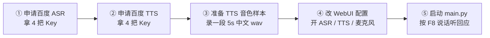


> 📎 **小贴士：为什么是百度而不是阿里 / 讯飞？**
>
> 项目代码里**内置实现了百度 ASR / 百度 TTS 的对接**（`pipeline/asr/baidu_asr.py`、`pipeline/tts/baidu_tts.py`），用其他厂商要自己改代码。**作者推测**：作者本人在用百度，所以默认支持最完整。我们跟随作者选型。
>
> ASR 还内置了 Whisper API 兼容（OpenAI 格式），但需要你有 OpenAI 账号或兼容服务。新手不推荐。

### ① + ② 申请百度智能云 ASR 和 TTS

百度智能云的注册流程不在本书范围内，但关键步骤我帮你列清楚：

1. 注册账号：[https://console.bce.baidu.com/](https://console.bce.baidu.com/)，用手机号注册即可（**新用户需要实名认证**，准备身份证）
2. 完成实名认证后，去 **语音技术** 控制台：[https://console.bce.baidu.com/ai-engine/speech/overview/index](https://console.bce.baidu.com/ai-engine/speech/overview/index)
3. 点 "**创建应用**"，给应用起个名字（比如 "ZerolanLiveRobot"）
4. 在 "**接口选择**" 里**同时勾上**：
  - 语音技术 → 短语音识别 / 短语音识别极速版
  - 语音技术 → 在线合成
5. 创建后，在应用列表里你会看到 4 个值——**4 把 Key**：
  - ASR 应用的 `API Key` 和 `Secret Key`
  - TTS 应用的 `API Key` 和 `Secret Key`

> ⚠️ **注意**：百度的"API Key + Secret Key"组合是一对的，不像 DeepSeek 那种单个 sk-xxx。**ASR 和 TTS 可以共用同一个应用的同一对 Key**（你建一个应用、同时勾上两个接口即可），也可以分开建两个应用。本书示例假设你建了**一个应用、共用一对 Key**。

每个新用户的免费额度大致是：

- 短语音识别：每天 5 万次
- 在线 TTS：每天 5 万次

个人玩**完全不会用完**。

把这 2 把 Key（实际上是 4 把，但你共用所以是 2 把）保存到一个安全的地方，我们待会儿要填进 WebUI。

### ③ 准备一个 TTS 音色样本（必须的，即使用百度 TTS）

这一步是项目的一个**遗留耦合**——即使你用百度 TTS（百度 TTS 不需要参考音频），项目里的 `TTSPromptManager` 也会**强制扫描 `resources/static/prompts/tts/` 目录**，找符合命名规则的 wav 文件。**目录空了就抛异常，程序起不来**。

> 🤔 **作者推测**：`TTSPromptManager` 是为 GPT-SoVITS（一种需要参考音频克隆音色的 TTS）设计的，作者后来加了百度 TTS 但没把这块解耦。下一版项目可能会修。**我们当下要做的就是糊弄它**——给它一个占位 wav 让它别报错。

**命名规则**（来自 `manager/tts_prompt_manager.py:32`）：

```text
[语言][情绪标签]这是音频里说的内容.wav
```

**示例**：

```text
[zh][Default]大家好我是测试.wav
[zh][开心]今天真开心呀.wav
[ja][羞耻]わたしのオナニーを見てください.wav
```

三个硬性约束：

1. **第一个方括号必须是语言码**：`zh` / `en` / `ja`（看 `common/enumerator.py:Language`）
2. **第二个方括号必须是情绪名**：**至少要有一个 `[zh][Default]xxx.wav`**——这是兜底音色，找不到匹配的情绪时用它
3. **后面的"这是音频里说的内容"必须是 wav 实际说的文字**：因为 GPT-SoVITS 模式会把它当成"参考音频的标注文本"。如果你用百度 TTS，这部分被忽略，但**文件名里这一段不能没有**

#### 怎么搞一个占位 wav

最简单的两种方法：

**方法 A**：用 Windows 自带的"录音机"应用（搜索 "录音机" 即可找到）。点录音、对着麦克风读一句"大家好我是测试"、停止、保存。然后用任何在线工具把 m4a 转成 wav——比如 [https://convertio.co/zh/m4a-wav/](https://convertio.co/zh/m4a-wav/)。

**方法 B**：直接下一个公开的中文 wav 测试文件。这里有一个示例：[https://www.voiptroubleshooter.com/open_speech/american.html](https://www.voiptroubleshooter.com/open_speech/american.html)（虽然是英文，但你只用作占位也行，文件名里写 `[zh][Default]xxx.wav` 即可——`TTSPromptManager` 只看文件名不看实际内容）。

不管哪种方法，最终你要在项目里这样放：

```text
ZerolanLiveRobot/
├── resources/
│   └── static/
│       └── prompts/
│           └── tts/
│               └── [zh][Default]大家好我是测试.wav   ← 这一个文件
```

确保 `resources/static/prompts/tts/` 目录存在（不存在就手动 mkdir），里面**至少有一个**符合命名规则的 wav 文件。

### ④ 改 WebUI 配置

启动 WebUI（命令行确保 `(ZerolanLiveRobot)` 环境激活，在项目根目录）：

```bash
python webui.py
```

浏览器打开 `http://127.0.0.1:7860`，**在第 2 章的配置基础上**做以下修改：

#### A. pipeline 标签页

**asr 子段**：


| 字段                            | 值                    |
| ----------------------------- | -------------------- |
| `enable`                      | ✅ 勾上                 |
| `model_id`                    | 下拉选 `BaiduASR`       |
| `baidu_asr_config.api_key`    | 填你的百度 ASR API Key    |
| `baidu_asr_config.secret_key` | 填你的百度 ASR Secret Key |


**tts 子段**：


| 字段                            | 值                    |
| ----------------------------- | -------------------- |
| `enable`                      | ✅ 勾上                 |
| `model_id`                    | 下拉选 `BaiduTTS`       |
| `baidu_tts_config.api_key`    | 填你的百度 TTS API Key    |
| `baidu_tts_config.secret_key` | 填你的百度 TTS Secret Key |


#### B. character 标签页

**speech 子段**：


| 字段            | 值                                   |
| ------------- | ----------------------------------- |
| `prompts_dir` | 保持默认 `resources/static/prompts/tts` |


#### C. system 标签页


| 字段                          | 值                          |
| --------------------------- | -------------------------- |
| `default_enable_microphone` | ✅ 勾上                       |
| `microphone_hotkey`         | 保持 `f8`（也可以改成你喜欢的，比如 `f9`） |
| `enable_sentiment_analysis` | ❌ 不勾（避免还要配额外的情感分析模型）       |
| `enable_clause_split`       | ❌ 不勾（避免分句 TTS 增加复杂度）       |


点 "**Save Config**" 保存。回到命令行 Ctrl+C 关掉 WebUI。

### ⑤ 启动并验证

回到命令行：

```bash
python main.py
```

你应该会看到比第 2 章多得多的日志。重点找以下几行：

```text
INFO  | manager.tts_prompt_manager:_load:120 - 1 TTS prompts (zh) loaded: ['Default']
INFO  | bot:__init__:54 - 🤖 Zerolan Live Robot: Initialized services successfully.
INFO  | bot:start:57 - 🤖 Zerolan Live Robot: Running...
INFO  | event.event_emitter:start:194 - TypedEventEmitter is running...
```

看到 "**1 TTS prompts (zh) loaded: ['Default']**"——你的占位音色加载成功了。

#### 真的按 F8 试一下

按下 F8。你应该看到：

```text
INFO  | bot:hotkey_handler:150 - Hotkey toggle: f8
DEBUG | bot:hotkey_handler:169 - Hotkey toggled: MIC ON
INFO  | devices.microphone:_vad_record:95 - Voice detected: Beginning.
```

对着麦克风说："你好。" 等大约 1 秒后停止说话（让 VAD 判断你说完了）：

```text
INFO  | devices.microphone:_vad_record:100 - Voice detected: Ending.
INFO  | bot:on_service_vad_speech_chunk:208 - ASR: 你好。
INFO  | bot:llm_query_handler:391 - LLM: 你好！很高兴见到你。
INFO  | bot:_tts_without_block:432 - TTS: 你好！很高兴见到你。
```

**与此同时**，你的扬声器应该响起 TTS 生成的语音回复。

恭喜——**整条链路打通了**。从这一刻起，你拥有了一个能跟你"说话"的 AI。后面 8 个驿站的动手实验，都基于这套环境。

#### 卡住了？查这张表


| 报错关键字                                        | 哪一步出问题     | 怎么解                                                                                |
| -------------------------------------------- | ---------- | ---------------------------------------------------------------------------------- |
| `There are no eligible TTS prompts`          | 步骤 ③       | 文件名格式不对、目录不对、或没文件                                                                  |
| `No suitable filename parsing strategy`      | 步骤 ③       | 某个 wav 命名不符合 `[lang][sentiment]xxx.wav` 格式，被跳过                                     |
| `Invalid language tag`                       | 步骤 ③       | 第一个方括号不是 `zh`/`en`/`ja`                                                            |
| `KeyError: 'access_token'` 或 `err_no: 110`   | 步骤 ①②      | 百度 API Key / Secret Key 错了                                                         |
| `ModuleNotFoundError: webrtcvad` 或 `pyaudio` | 步骤 2.4 装依赖 | 重装 `requirements.txt`，Windows 装 Build Tools                                        |
| 按 F8 没反应                                     | 步骤 ④       | 检查 `system.default_enable_microphone` 是 True 吗、`system.microphone_hotkey` 是 `f8` 吗 |
| 听不到声音                                        | 多种可能       | 看扬声器音量、看 `pygame.mixer` 是否正常初始化、看日志里 TTS 是否成功                                      |


排查完再来一次，直到你看到完整流程。

### 路径 B：不想配语音链路，怎么办？

如果你跳过了上面所有步骤——OK，你后面每个动手实验都会有一份"**路径 B**"备选方案，告诉你怎么用脚本直接 emit 事件来模拟"按 F8 说话"。

但**路径 B 看不到完整链路**（因为没有真实的 ASR/TTS/麦克风），你只能看到"事件从哪一站传到哪一站"，看不到"声音怎么变成文字、文字怎么变成声音"这种 AI 服务调用的细节。

是否值得配通完整链路，自己权衡。

### 路径 C：用本地 GPT-SoVITS 给她你自己的音色（进阶）

如果你已经在 ZerolanCore 体系**外**有了一个 GPT-SoVITS 模型——比如用 [GPT-SoVITS 官方仓库](https://github.com/RVC-Boss/GPT-SoVITS) 微调好了自己的音色，并且打算用它自带的 `api_v2.py` 单独提供服务——那么路径 A 的"百度 TTS"会浪费你的微调成果。这一节告诉你怎么让 ZerolanLiveRobot **直接调用你本地的 GPT-SoVITS api_v2**。

> ⚠️ **门槛声明**：这一节假设你**已经会用 GPT-SoVITS**——能跑 `api_v2.py`、知道怎么准备参考音频、能切换权重。如果这些对你还陌生，请先去看 GPT-SoVITS 自己的文档，再回来。

#### 为什么不能"直接改 URL"就完事

ZerolanLiveRobot 内部的 TTS 调用约定（看 `pipeline/tts/tts_sync.py:25-36` 的 `predict()`）是把一份 `TTSQuery` 序列化成 JSON 直接 POST 给 `predict_url`。理论上你只要把 `predict_url` 改成 `http://127.0.0.1:9880/tts`（GPT-SoVITS api_v2 的端点）就能连上。

**但字段名对不上**。把两边的接口并排放：

| ZerolanCore 内部约定（bot.py 构造） | GPT-SoVITS api_v2.py 期望 | 关系 |
|---|---|---|
| `text` | `text` | ✅ 同名 |
| `text_language`（值常为 `"auto"`） | `text_lang`（不接受 `"auto"`） | ❌ 改名 + 改值 |
| `refer_wav_path` | `ref_audio_path` | ❌ 改名 |
| `prompt_text` | `prompt_text` | ✅ 同名 |
| `prompt_language` | `prompt_lang` | ❌ 改名 |
| `audio_type`（如 `"wav"`） | `media_type`（如 `"wav"`） | ❌ 改名 |

6 个字段里 4 个名字不一样、1 个值的合法域不一样。**必须有一段"翻译"代码**横在中间。

#### 🆕 新概念：适配器模式（Adapter Pattern）

这种"两边接口语义相同但形式不同，中间夹一层做转换"的设计模式叫 **Adapter（适配器）**——名字非常形象，就像出国带的"电源转换头"，里面没什么逻辑、只是把 A 形状的插头转成 B 形状。

适配器有个明确的判断标准：

- 它**不创造新能力**——TTS 还是 GPT-SoVITS 做的
- 它**只翻译形式**——字段名映射、值域规范化、URL 拼接
- 它**对调用方透明**——bot.py 不需要知道它是适配器还是别的什么

本项目里其实已经存在两个 TTS 适配器了——`pipeline/tts/baidu_tts.py` 适配的是百度云 TTS 协议，`pipeline/tts/tts_sync.py` 默认走的 ZerolanCore HTTP 是"原生"调用。你要做的就是**仿照 `baidu_tts.py` 的样子**再写一个新适配器。

#### 你要做的三件事（宏观）

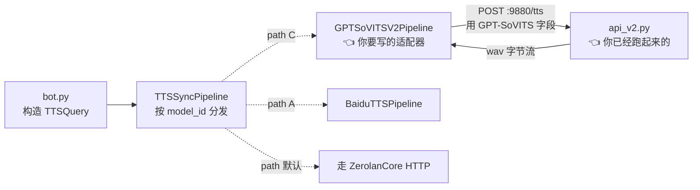

具体落到代码里是 **3 处改动**：

##### 改动 1：新建 `pipeline/tts/gpt_sovits_v2_tts.py`

写一个 `GPTSoVITSV2Pipeline` 类，照搬 `baidu_tts.py` 的"独立类、不继承基类"风格。**类骨架**：

```python
# pipeline/tts/gpt_sovits_v2_tts.py
import requests
from http import HTTPStatus
from loguru import logger
from zerolan.data.pipeline.tts import TTSQuery, TTSPrediction


class GPTSoVITSV2Pipeline:
    """
    Adapter for GPT-SoVITS api_v2.py.
    Bridges ZerolanLiveRobot's TTSQuery to api_v2 fields.
    """

    def __init__(self, base_url: str = "http://127.0.0.1:9880"):
        # TODO: 记下 base_url，以后拼 /tts 时用
        pass

    def _build_payload(self, query: TTSQuery) -> dict:
        # TODO: 关键 —— 字段映射 + auto fallback
        # 提示：
        #   - text_language 如果是 "auto"，要 fallback 到 "zh"
        #   - 6 个字段映射看上面那张表
        #   - streaming_mode 这里固定 False（先不搞流式，能跑了再说）
        raise NotImplementedError

    def predict(self, query: TTSQuery) -> TTSPrediction | None:
        # TODO:
        #   1. 调 _build_payload 拿到 dict
        #   2. requests.post 到 base_url + "/tts"
        #   3. 200 就把 response.content 包成 TTSPrediction 返回
        #   4. 非 200 打日志 + raise_for_status
        raise NotImplementedError

    def stream_predict(self, query, chunk_size=1024):
        # 路径 C 第一版可以先不实现流式，让它抛 NotImplementedError
        # bot.py 里 _tts_without_block 只调 predict()，不调 stream_predict()
        raise NotImplementedError("Not supported yet")
```

**关键设计提示**：

- `predict()` 返回的 `TTSPrediction` 的 `audio_type` 字段，**复用 `query.audio_type`**（用户传啥就回啥）
- `_build_payload` 是核心——记得 `text_language == "auto"` 时 fallback 到 `"zh"`（这是项目以中文为主场景）
- api_v2 失败时**返回 JSON 不是 wav**（看 `api_v2.py:445`），你的 `predict()` 要能 graceful 处理（HTTPStatus.OK 检查 + log）

**易踩的坑**：

| 坑 | 怎么躲 |
|---|---|
| 直接传 `text_language="auto"` 给 api_v2 | check_params 会 400 拒绝，必须 fallback |
| `ref_audio_path` 用相对路径或带反斜杠 | api_v2 在 Windows 下偶尔抽风，传**绝对路径 + 正斜杠**最稳 |
| `prompt_text` 不传 | api_v2 允许空，但音色克隆质量会下降——传上你参考音频对应的真实文字 |

##### 改动 2：在 `pipeline/tts/config.py` 加 enum 值

打开 `pipeline/tts/config.py` 找到 `TTSModelIdEnum`，**加一行**：

```python
class TTSModelIdEnum(BaseEnum):
    GPT_SoVITS = "AkagawaTsurunaki/GPT-SoVITS"
    GPT_SoVITS_V2_API = "GPT-SoVITS-V2-API"   # ← 新增
    BaiduTTS = "BaiduTTS"
```

枚举的字符串值会出现在 WebUI 的下拉框里，所以**起个人类可读的名字**就行（不必是仓库名）。

##### 改动 3：在 `pipeline/tts/tts_sync.py` 加分发分支

打开 `tts_sync.py`，在 `TTSSyncPipeline.__init__` 已有的 `if config.model_id == TTSModelIdEnum.BaiduTTS:` 后面**加一个 elif 分支**：

```python
# 伪代码示意 —— 自己写出来：
elif config.model_id == TTSModelIdEnum.GPT_SoVITS_V2_API:
    # 用户在 config.yaml 填的 predict_url 可能是
    #   "http://127.0.0.1:9880/tts"
    # 也可能是
    #   "http://127.0.0.1:9880"
    # 我们的适配器只要 base_url，所以 strip 一下尾巴
    base_url = ...  # TODO: 把 "/tts" 后缀去掉
    self.gpt_sovits_v2 = GPTSoVITSV2Pipeline(base_url=base_url)
    self.predict = self.gpt_sovits_v2.predict
    self.stream_predict = self.gpt_sovits_v2.stream_predict
```

**注意三件事**：

1. 别忘了在 `tts_sync.py` 顶部 `from pipeline.tts.gpt_sovits_v2_tts import GPTSoVITSV2Pipeline`
2. 把 `self.predict` 和 `self.stream_predict` **替换成适配器的同名方法**——这是项目里"运行时方法替换"的小把戏（看 baidu 那一支怎么写的）
3. `predict_url` 之所以被复用为 base url，是因为本项目没专门为 GPT-SoVITS V2 加新的配置字段——**复用现有字段最省事**，但你以后想加 `gpt_sovits_v2_config` 子段是更干净的做法

#### 改 WebUI 配置

启动 `python webui.py`，到 **pipeline → tts** 子段，把第 2.7 节路径 A 的配置改成：

| 字段 | 值 |
|---|---|
| `enable` | ✅ |
| `model_id` | 下拉选 `GPT-SoVITS-V2-API` |
| `predict_url` | `http://127.0.0.1:9880/tts` |
| `stream_predict_url` | `http://127.0.0.1:9880/tts` |
| `baidu_tts_config.*` | 留空 |

#### 准备参考音频 + 切到你微调的权重

**参考音频**——放进 `resources/static/prompts/tts/`，按 3.2 节 ③ 的命名规则。**关键**：文件名里的"内容描述"段必须是 wav 里**实际说的话**，因为这一段会作为 `prompt_text` 传给 api_v2，参与音色克隆。

举例：你微调时用的参考音频是 6 秒女声说"今天天气真好啊"，那就命名为：

```text
resources/static/prompts/tts/[zh][Default]今天天气真好啊.wav
```

**切换 GPT-SoVITS 的权重**——两种方法：

- **方法 A（推荐）**：改 GPT-SoVITS 项目下的 `GPT_SoVITS/configs/tts_infer.yaml`，把 `t2s_weights_path` 和 `vits_weights_path` 改成你微调出来的 `.ckpt` 和 `.pth` 路径。`api_v2.py` 启动时自动加载。
- **方法 B（运行时）**：浏览器访问下面两个 URL 切换：

  ```text
  http://127.0.0.1:9880/set_gpt_weights?weights_path=你的GPT权重.ckpt路径
  http://127.0.0.1:9880/set_sovits_weights?weights_path=你的SoVITS权重.pth路径
  ```

  返回 `success` 表示切好。Windows 路径含空格的话，先 URL-encode。

#### 启动顺序（两个进程，两个终端）

**终端 1**（先起 GPT-SoVITS）：

```bash
cd C:\Work\ai\GPT-SoVITS
python api_v2.py -a 127.0.0.1 -p 9880 -c GPT_SoVITS/configs/tts_infer.yaml
```

等输出 `Uvicorn running on http://127.0.0.1:9880`——加载模型一般 10–30 秒。

**终端 2**（再起 ZerolanLiveRobot）：

```bash
cd C:\Work\ai\ZerolanLiveRobot
conda activate ZerolanLiveRobot
python main.py
```

按 F8、说"你好"、听回应——这次回应应该是**你微调的那个音色**。

#### 卡住了？

| 现象 | 原因 | 怎么解 |
|---|---|---|
| 启动 main.py 报 `ImportError: GPTSoVITSV2Pipeline` | 改动 1 文件没建好，或改动 3 的 import 路径写错 | 检查文件名和 import 语句 |
| 听不到声音但 `TTS:` 日志已打 | api_v2 返回了非 200，或 wav 字节损坏 | 看终端 1 的 api_v2 日志，通常 `check_params` 失败 |
| api_v2 报 `text_lang: auto is not supported` | 你的 `_build_payload` 没做 auto fallback | 回去改适配器 |
| api_v2 报 `ref_audio_path is required` | 参考音频路径没传或文件不存在 | 检查 `resources/static/prompts/tts/` 路径和命名 |
| 音色不像你微调的 | 权重没切对，或参考音频不匹配 | 用方法 A 改 yaml + 用微调时的参考音频 |

#### 一个动手实验：用 curl 单独验证 api_v2

在动 ZerolanLiveRobot 代码**之前**，先单独验证 api_v2 是好的。终端跑：

```bash
curl -X POST "http://127.0.0.1:9880/tts" -H "Content-Type: application/json" -d "{\"text\":\"你好，这是测试\",\"text_lang\":\"zh\",\"ref_audio_path\":\"C:/Work/ai/ZerolanLiveRobot/resources/static/prompts/tts/[zh][Default]今天天气真好啊.wav\",\"prompt_text\":\"今天天气真好啊\",\"prompt_lang\":\"zh\",\"media_type\":\"wav\"}" --output test.wav
```

播放 `test.wav` 如果能听到合成语音——api_v2 工作正常，问题不在 GPT-SoVITS。**这一步先做完**再去写适配器代码，能省你 80% 的排错时间。

> 🤔 **作者推测：为什么 ZerolanLiveRobot 没原生支持 api_v2 路径？**
>
> 项目原作者走的是"**ZerolanCore + AkagawaTsurunaki/GPT-SoVITS（fork）**"组合——他在 ZerolanCore 端用自己 fork 的 GPT-SoVITS（接口和官方版略有不同），所以 `TTSModelIdEnum.GPT_SoVITS` 实际上是给那个 fork 用的，字段也是 ZerolanCore 风格。这给"想用官方 GPT-SoVITS"的用户留了空白——而你现在补的就是这个空白。
>
> **如果你愿意贡献**——这个适配器写完之后可以提个 PR，让其他想用官方 GPT-SoVITS 的用户都能受益。

---

## 3.3 一图看清整趟旅程

把整个"按 F8 说你好 → 听到回应"画成时序图：

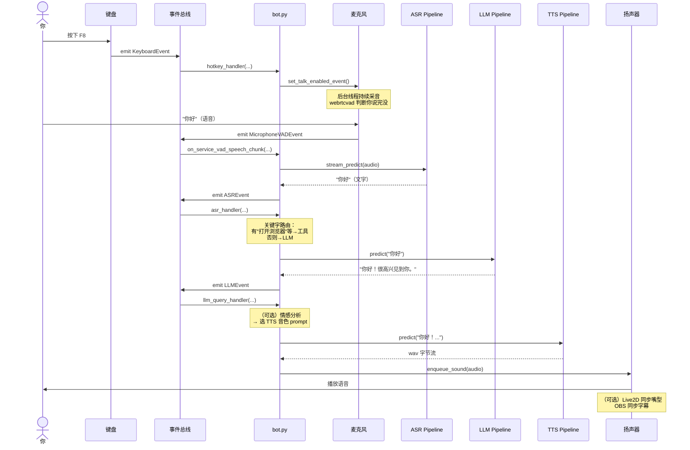


记住这张图——这就是这一章的**纲**。后面 8 个驿站，每讲一个就是在这张图里**点亮一个角色**。

注意几个关键观察：

1. **bot.py 是所有事件的"中转站"**——所有 handler 都注册在 bot.py 里，它负责"事件来了之后该叫哪个 Pipeline 干活"
2. **事件总线在中间**——每个角色发完事件就不管了，谁要看由总线分发
3. **整条链路是"事件触发事件"**——一个键盘事件触发麦克风开关，麦克风事件触发 ASR，ASR 事件触发 LLM，LLM 事件触发 TTS……像多米诺骨牌

---

## 3.4 旁观席布置：开 DEBUG 让程序大声告诉你它在做什么

正式开始解剖前，先把"观察工具"准备好——把日志级别从 `INFO` 调到 `DEBUG`，让程序把更多内部细节打出来。

### 🆕 新概念：loguru 的日志级别

项目用了一个叫 `loguru` 的日志库（比 Python 自带的 `logging` 好用很多）。loguru 的日志按"严重程度"分 7 级，从轻到重：

```text
TRACE  → DEBUG → INFO → SUCCESS → WARNING → ERROR → CRITICAL
（最详细）                                        （最严重）
```

- **TRACE / DEBUG**：开发者排查问题用的、海量琐碎细节
- **INFO**：用户应该看到的"程序在干什么"
- **WARNING / ERROR / CRITICAL**：出问题了

日志库的玩法是——你**设置一个最低级别**，比这个级别**低**的日志全部不显示。比如设 `INFO`，那 TRACE 和 DEBUG 就被吞掉；设 `DEBUG`，TRACE 还是不显示，但 DEBUG 及以上全显示。

第 2 章你看到的日志默认是 `INFO` 级别。本章我们要把它调到 `DEBUG`，因为很多关键细节（比如 `SpeechEvent received.`、`ASREvent emitted.`、`Tool called.`）都是 DEBUG 级别打出来的。

### 🛠️ 动手实验 ②：调到 DEBUG 重启程序

打开 `main.py`，看一眼它有多简短（19 行）：

```python
import asyncio
from bot import ZerolanLiveRobot
from loguru import logger


async def main():
    try:
        bot = ZerolanLiveRobot()
        await bot.start()
        await bot.stop()
    except Exception as e:
        logger.exception(e)
        logger.error("❌️ Zerolan Live Robot exited abnormally!")


if __name__ == '__main__':
    asyncio.run(main())
```

在 `import asyncio` 后面、`from bot import ...` 前面，加两行：

```python
import sys
logger.remove()
logger.add(sys.stderr, level="DEBUG")
```

- `logger.remove()` 移除 loguru 默认的输出（默认是 INFO 级别）
- `logger.add(sys.stderr, level="DEBUG")` 加一个新输出，级别为 DEBUG

完整改完后 `main.py` 长这样（前 8 行）：

```python
import asyncio
import sys
from loguru import logger

logger.remove()
logger.add(sys.stderr, level="DEBUG")

from bot import ZerolanLiveRobot
```

> ⚠️ **注意**：`logger.remove()` 必须在 `from bot import ...` 之前！否则 bot.py 里执行的 logger 调用还会用旧设置。

保存，重新运行：

```bash
python main.py
```

按 F8、说"你好"、再按 F8。

**对比一下**——你应该看到日志变得多了大约 **5 倍**：

- 多了大量 `DEBUG` 行
- 比如 `SpeechEvent received.`、`ASREvent emitted.`、`LLMEvent emitted.`、`Tool called.`
- 比如 `Function(id=xxx) hotkey_handler execution costs 0.001 s`（事件总线打的执行耗时）

> 📎 **小贴士：为什么开发者用日志而不是 print？**
>
> 三个原因：
>
> 1. **可关可开**——`print` 一旦写死就一直输出，日志可以按级别开关
> 2. **带元信息**——日志自动带时间戳、模块名、行号，print 没有
> 3. **可以转向文件**——日志可以同时打到屏幕和文件（loguru 一行 `logger.add("app.log")` 就行），print 默认只去屏幕
>
> 本项目所有"我要告诉开发者一件事"的场合都用 `loguru.logger`，没有一处 `print`。这是工程化的标志。

从下一节开始，每个驿站我们都会让你在 DEBUG 日志里找特定的字符串——它们就是你"看见事件流动"的眼睛。

---

## 3.5 第一站：按下 F8——一个键盘事件的诞生

### 故事

你按下 F8 的那一瞬间，物理上发生了什么？

1. F8 这颗物理键被按下，触发键盘上的电路开关
2. 键盘通过 USB 或者蓝牙告诉**操作系统**："F8 被按了"
3. 操作系统把这条按键消息**广播给所有正在前台运行的进程**（包括你的 main.py）
4. 你的 Python 进程里，**pynput 库的一条监听线程**收到这条消息
5. pynput 调用你（项目作者）注册的回调函数 `_on_key_press(key)`
6. 这个回调判断 F8 是不是"项目关心的热键"
7. 如果是——把它打包成一个 `DeviceKeyboardPressEvent` 事件，**扔到事件总线上**

注意——**至此 bot.py 还完全不知道你按了 F8**。它只是订阅了"键盘事件"这个频道，等总线把事件送过来。

### 代码追踪

完整的"键盘驿站"在 `devices/keyboard.py` 里，核心逻辑只有 20 多行。最关键的两个方法：

```51:62:devices/keyboard.py
    def _on_key_press(self, key):
        # logger.debug(f'Press {key}')
        if key not in self._hotkeys:
            return
        
        if self._toggle_debounce:
            return
        self._toggle_debounce = True
        self._current_hotkey = key

        emitter.emit(DeviceKeyboardPressEvent(hotkey=self.key_to_str(key)))
```

逐行解读：

- **第 54 行**：判断按下的键是不是项目关心的热键之一（配置在 `config.yaml` 的 `system.microphone_hotkey` 等位置）。不是就 return，不发事件——所以你按 A 按 B 不会触发任何东西
- **第 57–58 行**：防抖逻辑。`_toggle_debounce` 是一个布尔标志，防止你"长按"导致同一次按键触发多次事件
- **第 62 行**：真正发事件——`emitter.emit(DeviceKeyboardPressEvent(...))`。把 F8 包装成事件，扔进事件总线

### 🆕 新概念：事件 / 监听器 / 处理器

**事件（Event）** 在编程里指的是"一件刚刚发生的事的描述"。它通常是一个**只装数据、不带行为**的小对象。

在本项目里，事件长这样（来自 `event/event_data.py:82`）：

```82:84:event/event_data.py
class DeviceKeyboardPressEvent(BaseEvent):
    hotkey: str
    type: str = EventKeyRegistry.Device.KEYBOARD_HOTKEY_PRESS
```

一共只有两个字段：

- `hotkey: str`：哪个键被按了（"f8" / "f9" / ...）
- `type: str`：事件的类型标识——一个固定字符串 `"devices.keyboard"`（来自 `EventKeyRegistry`）

**监听器（Listener）** 或者叫 **处理器（Handler）**——就是"对这种事件感兴趣的人"。在本项目里，监听器通过装饰器注册：

```148:150:bot.py
        @emitter.on(EventKeyRegistry.Device.KEYBOARD_HOTKEY_PRESS)
        def hotkey_handler(event: DeviceKeyboardPressEvent):
            logger.info(f'Hotkey toggle: {event.hotkey}')
```

`@emitter.on(事件名)` 告诉总线："以后只要有 `devices.keyboard` 类型的事件，调一下我这个函数"。

> 🔍 **代码考古：`devices.keyboard` 还是 `device.keyboard`？**
>
> 留意 `EventKeyRegistry` 里其他键的命名（`event/registry.py:23-28`）：
>
> - `SCREEN_CAPTURED = "device.screen_captured"`
> - `KEYBOARD_HOTKEY_PRESS = "devices.keyboard"` ← 这一个是复数 devices
> - `MICROPHONE_VAD = "service.vad.speech_chunk"` ← 这一个还跑到 service 命名空间去了
> - `SPEAKER_PLAY = 'device.speaker.over'`
>
> 同一个 Device 命名空间下，四个事件的命名风格各不相同。**这是历史遗留的命名不规范**——但因为代码到处都引用 `EventKeyRegistry` 这个常量集中地，所以即使字符串不规范，也没有 bug 风险。
>
> 这种**"集中常量管理屏蔽字符串细节"**的做法本身是个好实践，但它也让"不规范"得以长期存活。**作者推测**：早期作者可能想统一命名，后来事情多了就懒得改了。如果你在贡献代码，可以提个 PR 统一。

### 🛠️ 动手实验 ③：按 F8 看日志，把字符串映射到代码

#### 路径 A（推荐，需要语音链路已配通）

1. `python main.py` 启动程序（已经开了 DEBUG 级别）
2. 按一下 F8（不要说话），立刻在日志里找以下几行：

```text
INFO  | bot:hotkey_handler:150 - Hotkey toggle: f8
DEBUG | bot:hotkey_handler:169 - Hotkey toggled: MIC ON
INFO  | devices.microphone:resume:145 - Resumed smart microphone.
```

1. **把每一行映射到代码**：
  - 第一行的 `bot:hotkey_handler:150` 表示 **bot.py 第 150 行**——回到 `bot.py:150`，那一行确实是 `logger.info(f'Hotkey toggle: {event.hotkey}')`
  - 第二行的 `:169` 是 `logger.debug(f'Hotkey toggled: MIC ON')`
  - 这说明你按下 F8 后，事件**真的**从键盘飞到了 bot.py 的 hotkey_handler
2. 再按一下 F8 关掉麦克风：

```text
INFO  | bot:hotkey_handler:150 - Hotkey toggle: f8
DEBUG | bot:hotkey_handler:158 - Hotkey toggled: MIC OFF
INFO  | devices.microphone:pause:140 - Paused smart microphone.
```

**观察点**：同一个键 F8 被按两次，触发的是**同一个 handler**，但因为 handler 内部有"麦克风当前状态"的判断（`is_set_talk_enabled_event()`），所以一次开、一次关。这是**事件 + 状态机**的典型模式——事件本身没有方向，状态决定动作。

#### 路径 B（脚本模拟，不需要语音链路）

新建 `tinker/keyboard_demo.py`（先 `mkdir tinker` 建个目录避免污染项目根）：

```python
from event.event_emitter import emitter
from event.event_data import DeviceKeyboardPressEvent
import asyncio

@emitter.on("devices.keyboard")
def my_handler(event: DeviceKeyboardPressEvent):
    print(f"[我的 handler] 收到了按键事件：{event.hotkey}")

async def main():
    asyncio.create_task(emitter.start())
    await asyncio.sleep(0.5)
    emitter.emit(DeviceKeyboardPressEvent(hotkey="f8"))
    emitter.emit(DeviceKeyboardPressEvent(hotkey="f9"))
    await asyncio.sleep(1)

asyncio.run(main())
```

跑 `python tinker/keyboard_demo.py`。你应该看到：

```text
[我的 handler] 收到了按键事件：f8
[我的 handler] 收到了按键事件：f9
```

**观察点**：你没有真的按键盘，也没有 pynput——你只是直接造了一个事件扔进总线。**总线和监听器根本不在乎事件是不是真的来自键盘**。这是发布订阅的核心威力，下一节会详讲。

---

## 3.6 第二站：事件总线——所有信件的中央邮局

### 故事

上一站结束时，键盘把事件扔进了"总线"。**但"总线"到底是什么？谁拿到了这个事件？**

我们看一下事件总线的最小心智模型：

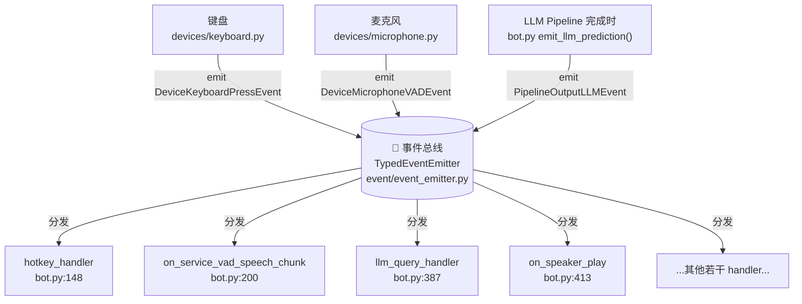


总线本质上是一个**字典**——key 是事件类型字符串（如 `"devices.keyboard"`），value 是"对这个事件感兴趣的 handler 列表"。

谁 emit 了事件，总线就去字典里查"谁订阅了这个事件类型"，然后**一个一个调用他们**。

### 🆕 新概念：发布订阅模式 (Pub-Sub)

这种"发件人不知道收件人是谁"的模式叫 **发布订阅模式（Publish-Subscribe Pattern）**——计算机界**最重要的设计模式之一**。

**为什么它重要？** 一个类比就够：

想象一家公司里的"内部邮件群发"。HR 发一封"通知：下周一全员体检"——HR 不需要知道公司有谁、每个人邮箱是什么。所有想看这种通知的人都"订阅"了 HR 的邮件群，他们各自接收、各自处理。

**没有这种模式时**——HR 必须维护一份"全员名单"，每发邮件就遍历一遍，CC 给所有人。**新员工入职 / 老员工离职**都要去更新 HR 的名单——非常脆弱。

**有了这种模式**——HR 只管发邮件到一个频道，新员工自己 subscribe 那个频道，离职自己 unsubscribe。HR 和员工**完全解耦**。

在本项目里，"键盘模块"和"麦克风开关逻辑"完全解耦：

- 键盘不知道"按 F8 之后会发生什么"
- bot.py 的 hotkey_handler 不知道"事件是从键盘来的还是从测试脚本来的"
- 两者之间只有一个**字符串约定**：`"devices.keyboard"`

这就是为什么本书后面所有模块都能**独立替换**——明天作者想把键盘换成"语音激活"（说"嘿小蓝"自动开麦），只需要新写一个模块 emit 同样类型的事件，bot.py 一行不用改。

### 代码追踪：总线的核心 30 行

事件总线的本体在 `event/event_emitter.py`，整个类几百行（处理同步/异步、超时、错误等），但**核心逻辑只有 30 行**。我们抽取最关键的部分（来自 `event_emitter.py:177-247`）：

```python
class TypedEventEmitter:
    def __init__(self):
        # 字典：事件类型字符串 → 监听器列表
        self._listeners: Dict[str, List[Listener]] = dict()

    def _add_listener(self, event: str, listener: Listener):
        if self._listeners.get(event, None) is None:
            self._listeners[event] = []
        self._listeners[event].append(listener)

    def on(self, event: str):
        # 装饰器：让 @emitter.on("xxx") 能注册函数
        def decorator(func: Callable):
            self._add_listener(event=event, listener=Listener(func=func, once=False))
        return decorator

    def emit(self, event: BaseEvent):
        # 发事件：去字典查这个类型的所有监听器，依次叫他们干活
        self._create_tasks(event.type, event)
```

核心数据结构就是 `_listeners` 这一个字典。`on()` 往字典里塞监听器，`emit()` 去字典里查并执行。

**完整的总线还做了两件事**（细节第 7 章详讲，这里点到为止）：

1. **区分同步 vs 异步 handler**——同步函数扔到线程池跑，异步协程扔到 asyncio 跑
2. **每个 handler 调用都有 5 秒超时警告**——超过 5 秒不会取消但会在日志里大喊"timeout!"

### 🛠️ 动手实验 ④：观察一次按键被几个 handler 同时收到

#### 路径 A

在 main.py 旁边，临时给 `KeyboardEvent` **加一个你自己的监听器**——验证"同一个事件可以被多个 handler 同时处理"。

打开 `main.py`，在 `from bot import ZerolanLiveRobot` **之后**加：

```python
from event.event_emitter import emitter
from event.event_data import DeviceKeyboardPressEvent

@emitter.on("devices.keyboard")
def my_spy(event: DeviceKeyboardPressEvent):
    logger.info(f"🕵️ [间谍] 我也看到了你按 {event.hotkey}!")
```

保存。重启 `python main.py`。按一下 F8。你会同时看到：

```text
INFO  | bot:hotkey_handler:150 - Hotkey toggle: f8
INFO  | main:my_spy:N - 🕵️ [间谍] 我也看到了你按 f8!
DEBUG | bot:hotkey_handler:169 - Hotkey toggled: MIC ON
```

**观察点**：你的"间谍" handler 和 bot.py 的 hotkey_handler **同时收到了同一个事件**，互不干扰、互不知道。这就是发布订阅的"多对多"能力。

#### 路径 B

不依赖语音链路。把上一节路径 B 的 `keyboard_demo.py` 改成：

```python
from event.event_emitter import emitter
from event.event_data import DeviceKeyboardPressEvent
import asyncio

@emitter.on("devices.keyboard")
def handler_a(event):
    print(f"[Handler A] 收到 {event.hotkey}")

@emitter.on("devices.keyboard")
def handler_b(event):
    print(f"[Handler B] 也收到 {event.hotkey}")

@emitter.on("devices.keyboard")
def handler_c(event):
    print(f"[Handler C] 我也收到了！")

async def main():
    asyncio.create_task(emitter.start())
    await asyncio.sleep(0.5)
    emitter.emit(DeviceKeyboardPressEvent(hotkey="f8"))
    await asyncio.sleep(1)

asyncio.run(main())
```

跑一下。三个 handler 都被触发——一个事件、多个接收方。

> 🤔 **作者推测：为什么这里没有"取消订阅"的 API？**
>
> 你可能注意到 `TypedEventEmitter` 没有 `off()` / `unsubscribe()` 方法——一旦你 `@emitter.on(...)` 注册了，就再也撤不下来。**作者推测**：本项目的所有监听器都在**初始化阶段一次性注册**（`bot.py` 的 `init()` 方法里），运行期没有动态增减需求，所以不需要取消接口。**这是一种"够用就好"的工程取舍**——不为不存在的需求过度设计。

---

## 3.7 第三站：麦克风 + VAD——它怎么知道你说完话了

### 故事

F8 按下、hotkey_handler 开了麦克风——下一步谁来"听你说话"？

答案是一条**早就在后台运行的线程**——`KillableThread(target=self.mic.start)`（来自 `bot.py:66`）。这条线程从程序启动那一刻起就一直在循环里转，**等"麦克风开关被打开"的信号**。

打开后，它从声卡里**每 30ms** 读一小段音频，然后送给一个叫 **VAD** 的小判官，问：

> "这 30ms 里有人说话吗？"

VAD 答 "有" 或 "没有"。然后这条线程根据 VAD 的回答决定：

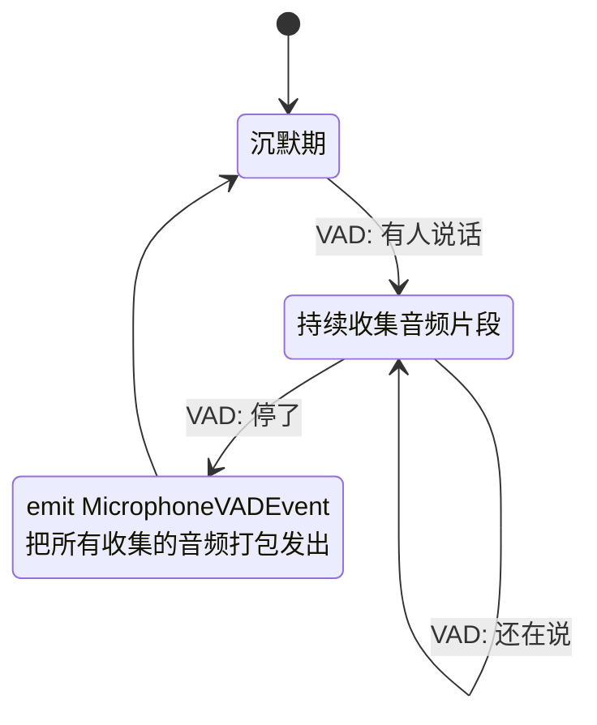


这就是为什么**你不需要"按住 F8 说话再松开"**——VAD 自动断句。你按一次 F8 是"打开麦克风"，再按一次 F8 是"关闭麦克风"，**中间你想说几句就说几句**。

### 🆕 新概念：VAD（Voice Activity Detection）

**VAD（语音活动检测）** 是一种小型算法——给它一段音频，它告诉你"这段里是不是有人在说话"。注意 VAD **不识别内容**——它只判断"有没有人声"。识别内容是 ASR 的事。

本项目用的是 Google 开源的 **WebRTC VAD**（一个 C++ 库的 Python 封装，叫 `webrtcvad`）。它的接口超简单：

```python
import webrtcvad
vad = webrtcvad.Vad(mode=3)  # mode 0-3，越大越严格
is_speech = vad.is_speech(audio_30ms_chunk, sample_rate=16000)
```

返回 `True` / `False`，就这么直接。

**为什么用 VAD 而不是用"按住说话再松开"？**

- 按住说话：用户体验差（你要一直按着键）
- 自动断句：更自然（你想说啥说啥，VAD 自动判断你停顿了 = 一句话结束了）

代价是 VAD 偶尔判断不准——比如你说话有思考停顿，VAD 可能误以为你说完了，提前切断。这是个**已知的取舍**。

### 代码追踪：麦克风的工作循环

完整代码在 `devices/microphone.py:63-90`：

```63:90:devices/microphone.py
    def start(self):
        super().start()
        # self._pause_event.set()
        self._stop_flag = False
        try:
            while not self._stop_flag:
                # self._pause_event.wait()
                self._stream_update()
                self._talk_enabled_event.wait()
                self._stream_update()
                
                if self._stop_flag:
                    break

                data = self._stream.read(self._chunk_size, exception_on_overflow=False)

                # 锁防止 hotkey 线程强制释放时同时读取
                with self._recording_lock:
                    self._vad_record(data)

        except Exception as e:
            logger.exception(e)
        finally:
            # Stop and close the microphone stream
            self._stream.stop_stream()
            self._stream.close()
            self._audio.terminate()
```

逐行解读：

- **第 71 行 `self._talk_enabled_event.wait()`**：这是关键——`talk_enabled_event` 是一个 `threading.Event` 锁，**初始是 clear（关）的**，线程在这里**阻塞**等待。直到 hotkey_handler 调 `self.mic.set_talk_enabled_event()` 把它置为 set（开），线程才往下走
- **第 77 行 `self._stream.read(...)`**：从声卡读 `chunk_size` 字节（30ms 的 16kHz 16-bit PCM = 960 字节）
- **第 81 行 `self._vad_record(data)`**：把这 30ms 数据送给 VAD 判官

VAD 判官的逻辑（`devices/microphone.py:91-107`）：

```91:107:devices/microphone.py
    def _vad_record(self, data: bytes):
        if self._enable_vad:
            if self._vad.is_speech(data, self._sample_rate):
                if not self._is_speaking:
                    logger.info("Voice detected: Beginning.")
                    self._is_speaking = True
                self._audio_frames.append(data)
            else:
                if self._is_speaking:
                    logger.info("Voice detected: Ending.")
                    self._is_speaking = False
                    self._emit_event()
                    self._audio_frames = []
        else:
            if not self._is_speaking:
                self._is_speaking = True
            self._audio_frames.append(data)
```

- 检测到人声开始：日志 "**Voice detected: Beginning.**" + 开始累积音频
- 检测到人声结束：日志 "**Voice detected: Ending.**" + emit 事件 + 清空缓冲

打包成 `DeviceMicrophoneVADEvent`，扔进事件总线。

### 🛠️ 动手实验 ⑤：观察 VAD 的"自动断句"行为

#### 路径 A

1. `python main.py` 启动
2. 按 F8 打开麦克风
3. **第一次**：保持沉默 5 秒——观察日志**不会**出现 `Voice detected: Beginning`
4. **第二次**：清晰地说"你好"，然后**立刻闭嘴**——观察日志：

```text
INFO  | devices.microphone:_vad_record:95 - Voice detected: Beginning.
INFO  | devices.microphone:_vad_record:100 - Voice detected: Ending.
```

1. **第三次**：说一句长一点的"今天天气真好啊我想出去走走"——观察 Beginning 和 Ending 中间隔了多久
2. **第四次**：说"今天……（停顿 2 秒）……天气真好"——你会发现 VAD **在那 2 秒停顿处切了一刀**，识别出**两句话**

观察点：

- VAD **真的**在判断有没有人声——沉默时不动
- VAD **不识别内容**——它不知道你说了"你好"还是"再见"
- VAD 的"停顿阈值"很敏感——只要你说话有较长停顿，就会被切成多句

#### 路径 B

VAD 实验比较难脱离麦克风模拟（你需要真实音频数据），跳过路径 B。如果你只想看 VAD 行为本身，可以单独跑 `tests/devices/test_mic.py`（项目自带的测试）。

> 🔍 **代码考古：注释掉的备份 VAD 实现**
>
> 看 `devices/microphone.py:175-187`——文件末尾有一大段注释掉的代码：
>
> ```python
> # 备份代码，以免 self._vad 作用不佳，作用于 bot.py - on_service_vad_speech_chunk 函数中
> # 检查音频数据是否超过最低响度阈值
> # threshold: 响度阈值, 一般安静房间的 RMS 可能在 100 以下, 正常说话在 1000-5000 左右
> import numpy as np
> threshold: float = 2200.0
> audio_array = np.frombuffer(speech, dtype=np.int16)
> rms = np.sqrt(np.mean(audio_array.astype(np.float32)**2))
> ```
>
> 这是作者写的"**备用方案**"——如果 WebRTC VAD 在某些环境下表现不好（比如背景噪声大），他还备了一套"按音量阈值过滤"的简单实现。**作者推测**：作者实际测试中遇到过 VAD 误报，但没有彻底解决，于是把备份方案留着以备不时之需。
>
> 这种"**留着备份方案不删**"的做法在工程上有争议——好处是出问题时可以快速切换，坏处是代码变脏。本书后面还会遇到几处类似的设计取舍。

---

## 3.8 第四站：ASR——声波变成文字

### 故事

麦克风把"你刚才说的那一段音频"打包成 `DeviceMicrophoneVADEvent` 扔进总线。总线问："谁订阅了这个事件？"——bot.py 里有一个 handler 举手：`on_service_vad_speech_chunk`。

这个 handler 的工作很简单：

1. 从事件里拿出音频字节
2. 把它包装成一个 ASR 调用请求
3. 调用 `ASR Pipeline.stream_predict()`——这一步**通过 HTTP** 发到云端 ASR 服务
4. 等回返回的文字
5. 把文字打包成新的 `PipelineASREvent` 扔回总线

注意第 3 步——**ASR 服务通常不在你本机**。本项目里有三种 ASR 来源：

- 百度 ASR（云端，按 OAuth + HTTP POST 调用）
- OpenAI Whisper（云端，按 HTTP POST 调用）
- ZerolanCore 本地（本机起一个服务，仍然按 HTTP POST 调用）

**无论哪一种，bot.py 看到的都只是"调一个对象的 predict 方法"——具体怎么调用、走哪个网络协议，全部被 Pipeline 这一层封装屏蔽了。**

### 🆕 新概念：Pipeline——对接外部 AI 服务的统一封装

**Pipeline** 是本项目里的一个核心抽象——所有"对接外部 AI 模型"的代码都叫 Pipeline，长在 `pipeline/` 目录下：

```text
pipeline/
├── asr/        ← 语音转文字
├── llm/        ← 大语言模型
├── tts/        ← 文字转语音
├── ocr/        ← 图片转文字
├── img_cap/    ← 图片描述
├── vla/        ← 视觉-语言-动作（ShowUI 屏幕点击）
└── vec_db/     ← 向量数据库（Milvus）
```

每个 Pipeline 内部都有一个**统一的接口**：

```python
class XXXPipeline:
    def predict(self, query) -> Prediction: ...
    def stream_predict(self, query): ...  # 流式版本
```

bot.py 只调 `self.asr.predict(query)` 或 `self.asr.stream_predict(query)`，**根本不关心 asr 是百度还是 Whisper 还是本地**。具体使用哪一个，由 `framework/context.py` 在初始化时根据 `config.yaml` 决定。

> ⏭️ **占位预告**：Pipeline 的完整设计——为什么有 sync 和 async 两套、为什么用 HTTP 而不是其他、怎么处理超时和重试——是**第 6 章的主题**。这里你只需要知道"Pipeline 是个对外封装"就够了。

### 代码追踪：handler → Pipeline → 事件

handler 本身只有 15 行（`bot.py:200-212`）：

```200:212:bot.py
        @emitter.on(EventKeyRegistry.Device.MICROPHONE_VAD)
        def on_service_vad_speech_chunk(event: DeviceMicrophoneVADEvent):
            logger.debug("`SpeechEvent` received.")
            speech, channels, sample_rate = event.speech, event.channels, event.sample_rate
            query = ASRStreamQuery(is_final=True, audio_data=speech, channels=channels, sample_rate=sample_rate,
                                   media_type=event.audio_type.value)

            for prediction in self.asr.stream_predict(query):
                logger.info(f"ASR: {prediction.transcript}")
                if is_blank(prediction.transcript):
                    continue
                emitter.emit(PipelineASREvent(prediction=prediction))
                logger.debug("ASREvent emitted.")
```

非常薄的一层：

- **第 203 行**：DEBUG 打印 `SpeechEvent received.`——告诉你 handler 收到了麦克风事件
- **第 204–205 行**：从事件里拆出音频参数，包装成 `ASRStreamQuery`
- **第 207 行**：调 ASR Pipeline 的流式接口（这里其实只 yield 一次，因为百度/Whisper 不真的流式）
- **第 208 行**：INFO 打印 `ASR: 你好。`——这是你**最爱看的一行**，因为它告诉你 ASR 转写出了什么
- **第 209 行**：空白结果跳过（VAD 偶尔抓到的杂音转出来可能是空字符串）
- **第 211 行**：把结果作为新事件 `PipelineASREvent` 扔回总线

下一站（LLM 那一站）的 handler 就订阅了 `PipelineASREvent`——它会接过这一棒。

### 百度 ASR 的内部：一次 HTTP POST

`self.asr.stream_predict(query)` 内部发生了什么？我们点开 `pipeline/asr/baidu_asr.py:33-72`（节选）：

```python
def predict(self, query: ASRQuery):
    url = "https://vop.baidu.com/server_api"
    # 把音频读成 bytes，base64 编码
    audio_base64 = base64.b64encode(data).decode('utf-8')
    payload = json.dumps({
        "format": query.media_type,        # "wav"
        "rate": query.sample_rate,         # 16000
        "channel": 1,
        "cuid": self._cuid,                 # 一个 UUID 标识"是谁在调"
        "speech": audio_base64,
        "len": data_len,
        "token": self._access_token        # 之前用 API Key/Secret Key 换的临时 token
    }, ensure_ascii=False)
    response = requests.request("POST", url, headers=headers, data=payload.encode("utf-8"))
    response.raise_for_status()
    response = json.loads(response.text)
    return ASRPrediction(transcript=response['result'][0])
```

去除装饰逻辑，本质就是**一次 HTTP POST**——把音频 base64 编码丢上去，等百度回一段 JSON，从里面挖出 `result[0]` 当转写结果。

> 📎 **小贴士：为什么用 base64 编码音频？**
>
> HTTP 请求体可以传任何二进制数据，但**JSON 格式只能装文本**。本项目这里把音频塞进 JSON 字段，就必须把二进制转成"安全的文本"——base64 就是干这个的。代价是数据膨胀 33%（3 字节变 4 字符），但好处是兼容性极好。
>
> 另一种做法是 multipart/form-data 上传（项目里 Whisper ASR 就是这么干的，看 `pipeline/asr/whisper_asr.py`）——不用 base64 但格式更复杂。两种都行，看 API 文档要求。

### 🛠️ 动手实验 ⑥：故意挑战 ASR 的边界

#### 路径 A

启动 `python main.py`，按 F8。**依次说**以下几句话（每句后等 1 秒让 VAD 断句）：

1. **正常清晰**："今天天气真好"
2. **带方言口音**：用你的方言说"你好" / "吃了吗"
3. **混入英文**："hello world 我是测试"
4. **故意含糊**：嘴里"嗯......嗯......嗯"
5. **故意小声**：贴近麦克风说"小声测试"
6. **故意大声**：大喊一声"啊！"

每次都观察日志里的 `ASR: xxxx` 这一行——把它和你实际说的对比。

可能的观察结果：

- 标准普通话识别准确
- 方言识别率明显下降
- 英文夹中文：百度 ASR 可能完全识别成中文谐音（百度短语音识别**默认是中文模型**）
- 含糊的"嗯嗯嗯"可能识别成空字符串或者奇怪的字
- 大喊可能因为爆音被识别错

**观察点**：

- ASR **不是万能**——它有训练数据偏好、有响度限制、有语种限制
- ASR 的**输入质量决定输出质量**（业内说 "garbage in, garbage out"）
- 项目代码在 `is_blank(prediction.transcript)` 这里做了空白过滤——所以你说含糊的话被识别成空字符串时，事件**不会**继续往下传

#### 路径 B

如果你不想配 ASR，可以用一段提前录好的 wav 跑独立 ASR 测试。新建 `tinker/asr_demo.py`：

```python
from manager.config_manager import get_config
from pipeline.asr.asr_sync import ASRSyncPipeline
from zerolan.data.pipeline.asr import ASRQuery

config = get_config()
asr = ASRSyncPipeline(config.pipeline.asr)
query = ASRQuery(
    audio_path="resources/static/prompts/tts/[zh][Default]大家好我是测试.wav",
    media_type="wav",
    sample_rate=16000,
    channels=1
)
prediction = asr.predict(query)
print(f"识别结果：{prediction.transcript}")
```

跑之前要把 `config.yaml` 的 `pipeline.asr.enable` 开成 True、填好百度 ASR Key（无需启动 main.py，单独跑这个脚本）。

输出应该是你那个占位 wav 里念的内容。**这个实验证明：ASR Pipeline 可以脱离整个程序独立运行**——这是好架构的标志。

---

## 3.9 第五站：LLM——大脑思考 + 决定调哪个工具

### 故事

ASR 把"你好"两个字以事件形式扔进总线。总线一查——`PipelineASREvent` 的订阅者是 `asr_handler`（bot.py:214）。

这位 handler **不是直接调 LLM**——它先做一件事：**关键字检查**。

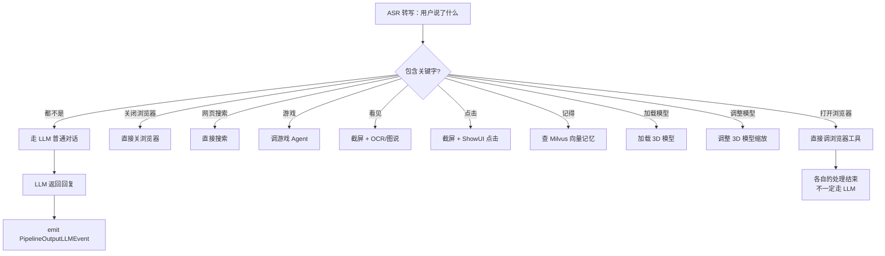


这是一个**关键字优先 + LLM 兜底**的设计。常用命令走硬编码的"快通道"，避免每次都让 LLM 思考；只有 LLM 才能回答的开放性对话才走 LLM。

> 🤔 **作者推测：为什么不全部交给 LLM 做意图识别？**
>
> 把所有意图都交给 LLM 判断（"用户说'打开浏览器'，请决定是调 browser 工具还是普通对话"）确实更优雅，但有 3 个代价：
>
> 1. **延迟**：LLM 调用要几百毫秒，硬编码 if-elif 是微秒级
> 2. **可控性**：LLM 偶尔会"幻觉"调错工具，硬编码不会
> 3. **成本**：每次对话都多一次 LLM 调用，token 消耗翻倍
>
> 所以**作者选了一个混合方案**——常见、稳定、明确的命令用关键字；其他都交给 LLM。这是个**实用主义的工程决策**，不"优雅"但有效。

### 关键字路由的代码

看 `bot.py:214-289`——`asr_handler` 整个函数的结构，**就是一长串 if-elif**：

```python
@emitter.on(EventKeyRegistry.Pipeline.ASR)
def asr_handler(event: PipelineASREvent):
    prediction = event.prediction
    if "打开浏览器" in prediction.transcript:
        self.browser.open("https://www.bing.com")
    elif "关闭浏览器" in prediction.transcript:
        self.browser.close()
    elif "网页搜索" in prediction.transcript:
        # ...略
    elif "看见" in prediction.transcript:
        # 截屏 → OCR/图说
    elif "点击" in prediction.transcript:
        # 截屏 → ShowUI 视觉点击
    elif "记得" in prediction.transcript:
        # 查 Milvus 向量记忆
    # ...更多 elif...
    else:
        if self.playground:
            # ToolAgent 再做一次工具调用判断
            tool_called = self.custom_agent.run(prediction.transcript)
            if tool_called:
                logger.debug("Tool called.")
        self.emit_llm_prediction(prediction.transcript)  # 兜底：走 LLM
```

**注意 else 分支**——即使关键字都没命中，`emit_llm_prediction` 之前还有一步 `self.custom_agent.run(...)`。这是 LangChain 的 ToolAgent——它会让 LLM 做"二级意图识别"，决定要不要调用更复杂的工具（这部分**第 9 章**详讲）。

### LLM 调用本体

`emit_llm_prediction(text)`（bot.py:461）的核心 3 行：

```python
query = LLMQuery(text=text, history=self.llm_prompt_manager.current_history)
prediction = self.llm.predict(query)
emitter.emit(PipelineOutputLLMEvent(prediction=prediction))
```

- `LLMQuery` 装了**两样东西**：你这次说的话 + **历史对话**（这就是为什么 LLM 能"记得"你前面说过什么）
- `self.llm.predict(query)` 调用 LLM Pipeline——内部走 OpenAI 兼容协议，HTTP POST 到 DeepSeek/Kimi/豆包
- 结果作为 `PipelineOutputLLMEvent` 扔回总线，下游 TTS 站接

### 🆕 新概念：Prompt / 历史对话 / Tool Calling

- **Prompt（提示词）**：你发给 LLM 的"输入文本"。可以是简单一句话，也可以是带"你是一个 AI 助手，请用幽默风格回复"这种系统指令的复杂结构
- **历史对话（History）**：LLM 本身是**无状态**的——它每次调用之间不记得之前说过什么。要让它"记忆"，必须把**完整的对话历史**每次都发回去。这就是为什么 `LLMQuery.history` 字段存在。本项目用 `LLMPromptManager` 管理这份历史（**第 9 章**详讲）
- **Tool Calling**：让 LLM 决定"是否调用某个工具（函数）"的能力。比如用户问"现在几点"，LLM 不直接编一个时间，而是返回一个"我想调用 `get_current_time()` 函数"的结构化指令。本项目用 LangChain 实现（**第 9 章**详讲）

### 🛠️ 动手实验 ⑦：连续三轮对话验证上下文 + 触发关键字路由

#### 路径 A

启动 `python main.py`，按 F8。**依次进行**：

**实验 ⑦.a 验证上下文记忆**：

1. 说："请记住一个名字：张三。"
  - 听到她回复确认
2. 说："你刚才记住的那个名字是什么？"
  - 听到她回复"张三"
3. 观察日志，注意 `Length of current history` 这一行：

```text
INFO  | bot:emit_llm_prediction:477 - Length of current history: 4
```

第二轮对话时这个数字应该是 4（你 1 句 + 她 1 句 + 你 1 句 + 她 1 句的累加），第三轮会是 6——证明**历史在累加**。

**实验 ⑦.b 触发关键字路由**：

1. 说："今天天气怎么样？"
  - 走 LLM 普通对话
2. 说："请打开浏览器。"
  - 注意日志**没有 `LLM:` 这一行**——直接被关键字命中，调了 browser 工具（如果配了的话）
3. 说："你能看见吗？"——触发截屏 + OCR/图说

**观察点**：

- 同样是"语音输入"，**不同的输入走完全不同的路径**——关键字命中的根本不调 LLM
- 项目的"智能" = LLM 的能力 + 大量硬编码逻辑——理解这一点对评估"AI 智能体"很重要

#### 路径 B

继续用第 2 章的 `quick_test.py`，扩展成多轮对话：

```python
from zerolan.data.pipeline.llm import LLMQuery, Conversation, RoleEnum
from manager.config_manager import get_config
from pipeline.llm.llm_sync import LLMSyncPipeline

config = get_config()
llm = LLMSyncPipeline(config.pipeline.llm)

history = []
for user_input in ["请记住一个名字：张三。", "我让你记住的名字是什么？"]:
    query = LLMQuery(text=user_input, history=history)
    prediction = llm.predict(query)
    print(f"你：{user_input}")
    print(f"她：{prediction.response}\n")
    history = prediction.history  # 关键：把回复后的新历史传给下一轮
```

跑一下，看第二轮她是否能答出"张三"。如果能，证明历史机制工作正常。

---

## 3.10 第六、七站：TTS + 扬声器——文字回到声音

我们把 TTS 和扬声器合并讲——它们紧密配合，分开讲反而割裂。

### 故事

LLM 返回了"你好！很高兴见到你。"，作为 `PipelineOutputLLMEvent` 扔进总线。订阅者是 `llm_query_handler`（bot.py:387）。这位 handler 做三件事：

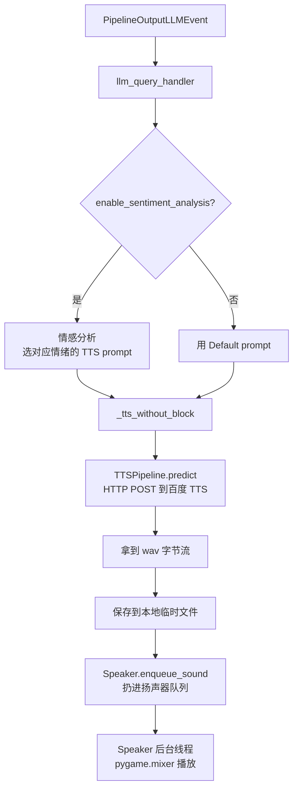


注意 `_tts_without_block` 这个名字——它把 TTS 调用放进**线程池**异步执行，**不阻塞**当前 handler。这样事件总线的其他工作不会被 TTS 卡住。

### 🆕 新概念：情感分析与 TTS prompt 选择

**情感分析（Sentiment Analysis）** 是 NLP 的一个经典任务——给一段文本，判断它的"情感倾向"（开心/难过/愤怒/中性...）。

本项目用情感分析做一件具体的事：**根据 LLM 回复的情绪挑对应的音色样本**。

回想 3.2 节我们放进去的占位音频——`[zh][Default]xxx.wav`。如果你**多放几个**：

```text
[zh][Default]大家好我是测试.wav
[zh][开心]今天真开心呀.wav
[zh][难过]我不想说话了.wav
[zh][愤怒]给我滚出去.wav
```

那么 `TTSPromptManager` 会把它们全部加载，每个对应一种"情绪"。`llm_query_handler` 拿到 LLM 回复后：

1. 用情感分析判断回复属于哪种情绪
2. 找到对应的 `.wav` 文件作为**参考音频**
3. 把参考音频和文本一起发给 TTS——这样 TTS 生成的语音会**带上那种情绪**

> ⚠️ **重要前提**：这套机制对 **GPT-SoVITS** 才完全有效（它能从参考音频克隆音色）。如果你用百度 TTS，参考音频字段**根本不会被使用**——百度 TTS 的音色是固定的"标准女声/标准男声"，不能克隆。
>
> 这就是为什么我们在 3.2 节建议你 **enable_sentiment_analysis 关掉**——百度 TTS 用不上情感选音色，开了反而多一次无效的 LLM 调用。

### 代码追踪：从 LLM 回复到 wav 字节

`llm_query_handler` 的主要部分（bot.py:387-407 简化）：

```python
@emitter.on(EventKeyRegistry.Pipeline.LLM)
def llm_query_handler(event: PipelineOutputLLMEvent):
    text = event.prediction.response
    logger.info("LLM: " + text)
    if self.enable_sentiment_analysis:
        sentiment = sentiment_analyse(...)
        tts_prompt = self.tts_prompt_manager.get_tts_prompt(sentiment)
    else:
        tts_prompt = self.tts_prompt_manager.default_tts_prompt
    self._tts_without_block(tts_prompt, text)
```

`_tts_without_block` 干的事（bot.py:421-437）：

```python
def _tts_without_block(self, tts_prompt: TTSPrompt, text: str):
    def wrapper():
        query = TTSQuery(text=text, text_language="auto",
                         refer_wav_path=tts_prompt.audio_path,
                         prompt_text=tts_prompt.prompt_text,
                         prompt_language=tts_prompt.lang,
                         audio_type="wav")
        prediction = self.tts.predict(query=query)
        logger.info(f"TTS: {query.text}")
        self.play_tts(PipelineOutputTTSEvent(prediction=prediction, transcript=text))
    self.tts_thread_pool.submit(wrapper)
```

注意最后一行 `self.tts_thread_pool.submit(wrapper)`——把 wrapper 函数扔进一个**单线程线程池**异步跑。为什么单线程？因为**音频播放需要按顺序**，多个 TTS 并发反而会让回复顺序乱。

### 扬声器播放：pygame.mixer + 队列

`self.play_tts(...)` 最终调到 `Speaker.enqueue_sound(audio_path)`（bot.py:533）。Speaker 内部有一个**音频队列**和**专门的播放线程**（`devices/speaker.py:51-59`）：

```python
def _run(self):
    while not self._stop_flag:
        if self.audio_clips.empty():
            self._semaphore.clear()
        self._semaphore.wait()
        audio_clip = self.audio_clips.get()
        emitter.emit(DeviceSpeakerPlayEvent(audio_path=audio_clip))
        self.playsound(audio_clip, block=True)  # pygame.mixer 同步播放
```

观察：

- **队列驱动**：多个 TTS 结果可以排队播放，不会互相打断
- **emit 一个 `DeviceSpeakerPlayEvent`**：这个事件没人当回事用音频本身——它专门给 **OBS 字幕** 用（`bot.py:413` 的 `on_speaker_play` 订阅了它，触发 OBS 字幕更新）

> 🔍 **代码考古：为什么扬声器要 emit 事件，而不是 LLM handler 直接通知 OBS？**
>
> 因为**字幕显示的时机和音频播放的时机必须同步**——LLM 早早返回了，TTS 也合成完了，但音频可能还在队列里等播。**只有真正开始播放那一刻**，字幕才该亮。
>
> 所以**字幕显示这件事的触发点是 Speaker 而不是 LLM**——这是一个细节但关键的设计。

### 🛠️ 动手实验 ⑧：观察 TTS prompt 选择 + 音频队列效果

#### 路径 A

**实验 ⑧.a 多 prompt 的加载**：

去 `resources/static/prompts/tts/` 目录，**复制**那个占位 wav 几份，改不同的情绪标签名：

```text
[zh][Default]大家好我是测试.wav
[zh][开心]大家好我是测试.wav   ← 复制的
[zh][难过]大家好我是测试.wav   ← 复制的
```

（音频内容不必真的对应——百度 TTS 不用参考音频）

重启 `python main.py`，注意日志：

```text
INFO  | manager.tts_prompt_manager:_load:120 - 3 TTS prompts (zh) loaded: ['Default', '开心', '难过']
```

加载从 1 个变成 3 个——证明 `TTSPromptManager` 在扫描你的目录。

**实验 ⑧.b 触发连续 TTS 看队列**：

把 `enable_clause_split` 重新打开（WebUI 改 + 重启），按 F8，说一段长一点的话：

"你给我介绍一下你自己，要详细一点，分几段说。"

LLM 返回的长回复会被切成几段，每段一次 TTS 调用。看日志会出现连续多个 `TTS: xxx` 行，对应扬声器**依次**播放（不会同时播）——这就是音频队列的效果。

#### 路径 B

写一段独立脚本 `tinker/tts_demo.py`：

```python
from manager.config_manager import get_config
from pipeline.tts.tts_sync import TTSSyncPipeline
from devices.speaker import Speaker
from zerolan.data.pipeline.tts import TTSQuery
from common.io.api import save_audio
from common.io.file_type import AudioFileType
import time

config = get_config()
tts = TTSSyncPipeline(config.pipeline.tts)
speaker = Speaker()
speaker.start()

query = TTSQuery(text="你好，我是 ZerolanLiveRobot。这是一段测试。",
                 text_language="auto",
                 refer_wav_path="",  # 百度 TTS 不需要
                 prompt_text="",
                 prompt_language="zh",
                 audio_type="wav")
prediction = tts.predict(query)
audio_path = save_audio(prediction.wave_data, format=AudioFileType.WAV, prefix="demo")
speaker.enqueue_sound(audio_path)

time.sleep(5)  # 等播放完
```

跑一下应该能听到扬声器播报。**这一个脚本独立验证了 TTS Pipeline + Speaker 都工作正常**——绕过了所有事件总线和 LLM 的复杂性。

---

## 3.11 第八站：嘴型与字幕——你看到的"她在说话"

### 故事

到上一站为止，你已经"听见"她说话了。但如果你启用了 Live2D（虚拟形象），你还会**看见**她的嘴在动、屏幕上有字幕滚动。这是怎么做到的？

两条**并行的轨道**：

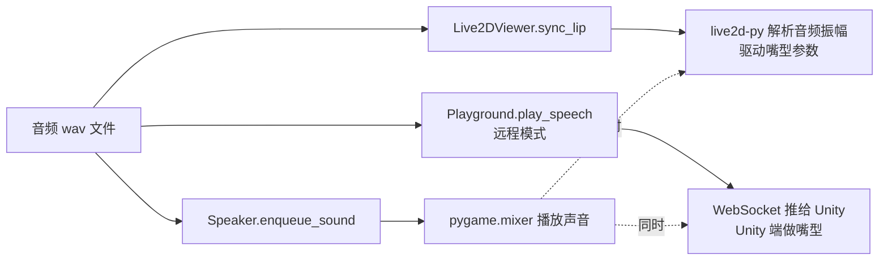


注意——**声音、嘴型、字幕是三件几乎同时启动的事**。它们各自走自己的路，不互相等。这种"用同一份数据驱动多种表现"的模式叫 **fan-out（扇出）**。

### 代码追踪：play_tts 的分发

`bot.py:518-534` 的 `play_tts` 方法：

```python
def play_tts(self, event: PipelineOutputTTSEvent):
    prediction = event.prediction
    text = event.transcript
    self.subtitles_queue.put(text)  # 字幕入队
    audio_path = save_audio(wave_data=prediction.wave_data, ...)
    if self.live2d_viewer:
        self.live2d_viewer.sync_lip(audio_path)  # 本地 Live2D 嘴型
    if self.playground:
        if self.playground.is_connected:
            self.playground.play_speech(...)  # 远程 Unity 播放
            logger.debug("Remote speaker enqueue speech data")
    else:
        self.speaker.enqueue_sound(audio_path)  # 本地音箱
        logger.debug("Local speaker enqueue speech data")
```

要点：

- **本地模式 vs 远程模式**：`playground` 是 Unity Playground 项目（ZerolanLiveRobot 生态的另一个独立项目）的客户端连接。如果它在连，**声音和形象都交给 Unity 渲染**，本地只播字幕给 OBS。如果没连，本地用 pygame.mixer 放声音 + live2d-py 渲染嘴型
- **嘴型驱动**：`Live2DViewer.sync_lip(audio_path)` 内部用 `live2d-py` 的 `wavHandler.Start(audio_path)`（`services/live2d/live2d_viewer.py:51`）——库内部解析 wav 的振幅曲线，自动算出嘴型参数

### 字幕的传递路径

LLM 回复的文本要做**两次广播**：

1. 在 `play_tts` 里放进 `self.subtitles_queue`
2. Speaker 真正开始播放时 emit `DeviceSpeakerPlayEvent`
3. `on_speaker_play` handler 接到这个事件 → 从队列里取出文本 → 发给 OBS

为什么这么绕？因为**字幕的时机必须等到音频真的开始播**（队列里可能排队几个 TTS）。3.10 节末尾的"代码考古"已经说过这点。

### 嘴型同步的极简实现

`services/live2d/live2d_viewer.py:47-53`：

```python
def _sync_lip_loop(self):
    while self._sync_lip_loop_flag:
        try:
            audio_path = self._audios.get(block=True)
            self._canvas.wavHandler.Start(str(audio_path))
        except Exception as e:
            logger.exception(e)
```

整个嘴型同步只有 5 行有效代码——**全靠 `live2d-py` 这个库**做事。

> 🤔 **作者推测：为什么嘴型是"音频驱动"而不是"文字驱动"？**
>
> 一种更"精细"的做法是从文字推音素，再从音素推嘴型（业内叫 viseme）——这样嘴型能精确对应每个发音。但本项目用的是"按音频振幅推开合"——粗暴但有效：声音大嘴张大、声音小嘴张小。
>
> **代价**：嘴型只能开合，没有"o" / "u" / "i" 这种区分。看上去像在"对口型"但不真正对。
>
> **好处**：实现简单、跨语言通用（不用为每种语言写一套音素表）。
>
> 对一个开源个人项目，这个取舍非常合理。

### 不做动手实验的原因

Live2D 涉及 PyQt5 窗口、显卡渲染、模型文件路径等复杂配置。**为了让 8 个驿站都跑通，这一站我们不强求动手**——你能"听见"她说话已经覆盖了 95% 的链路理解。

如果你以后想完整体验视觉效果，准备一份 Live2D 模型（`.model3.json` 文件），在 `config.yaml` 的 `service.live2d_viewer` 里配上路径，启用即可。或者去看 ZerolanPlayground 项目（Unity 版本）。

---

## 3.12 全景图：把所有点连成线

现在你已经走过全部 8 个驿站。我们回到 3.3 的图，但这次**每个节点都标注上：文件、事件、Pipeline**——这是一张你应该**合上书能默写**的"复习卡"。

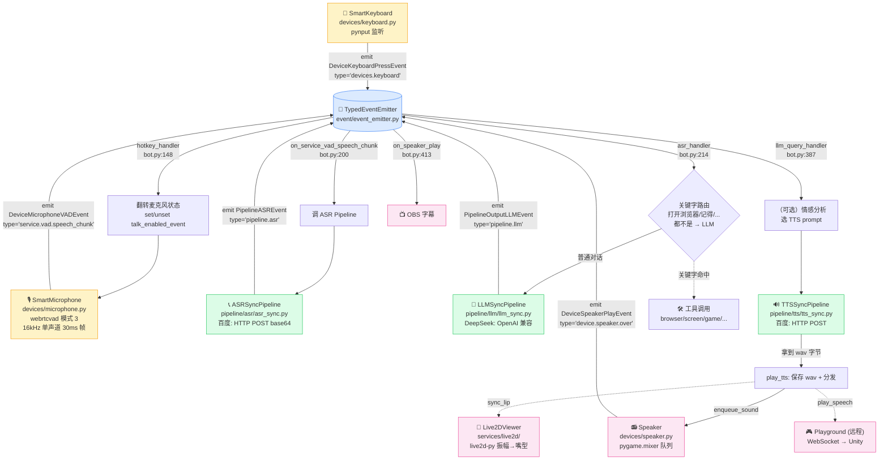


**读图的几个观察点**：

1. **bot.py 是控制中枢**——所有 handler 全部在 bot.py 注册。它本身不实现任何能力，只**连接**事件和 Pipeline / 设备
2. **Pipeline 是无状态的**——ASR/LLM/TTS 都是"传入 query → 返回 prediction"的函数式接口
3. **设备类（Keyboard / Microphone / Speaker / Live2D）有状态**——它们各自管理自己的线程和资源
4. **事件总线是"胶水"**——没有它，bot.py 必须导入所有设备和 Pipeline 直接调用，耦合极高
5. **关键字路由是个分叉点**——常见命令走快速通道，开放对话走 LLM

把这张图记下来。后续每一章都是在**放大**这张图的某个局部。

---

## 3.13 几个没回答的问题（后续章节预告）

走完 8 个驿站，你脑中应该已经"长出"了几个问题。我把可能的问题和答案位置列在这里——读后续章节时带着问题去读，效率会高很多：


| 你可能在想                                                   | 答案在哪一章                       |
| ------------------------------------------------------- | ---------------------------- |
| 这么多线程是怎么协调的？事件总线不会因为某个 handler 卡住而堵塞吗？                  | **第 4 章 并发与生命周期**            |
| 配置改完为什么要重启程序？热更新行不行？                                    | **第 5 章 Pydantic 与配置体系**     |
| Pipeline 为什么有 sync 和 async 两套实现？区别在哪？                   | **第 6 章 Pipeline 与 AI 服务对接** |
| 事件总线为什么不用 Python 自带的 `asyncio.Event`？为什么自己写一个？          | **第 7 章 事件总线深入**             |
| 程序按 Ctrl+C 退出时为什么有时候有异常 traceback？KillableThread 真的安全吗？ | **第 8 章 生命周期与优雅退出**          |
| ToolAgent / CustomAgent 怎么"让 LLM 决定调哪个工具"？这不是它脑补吗？      | **第 9 章 Agent 与工具调用**        |
| Bilibili / OBS / QQ / Minecraft 这些外部服务，集成的统一模式是什么？      | **第 10 章 外部服务集成**            |
| Playground / WebSocket / ZerolanProtocol 怎么把数据传给 Unity？ | **第 11 章 跨进程通信**             |
| 整个项目里哪些是"作者拍脑袋决定的"，哪些是"非这样不可"的？                         | **第 12 章 设计决策与权衡**           |


每个问题对应一章——这就是为什么我们前面说"**第 3 章是地图，后面 9 章是详图**"。

---

## 3.14 本章小结

走完整章，你应该已经：

1. 把语音链路配通了——能"按 F8 → 说话 → 听见回应"
2. 在 DEBUG 日志里**亲眼看到**事件如何在 8 个驿站间流动
3. 理解"**事件总线 + 发布订阅**"是这个项目的中枢神经
4. 理解"Pipeline 是对外封装"、"设备类有状态"、"bot.py 是控制中枢"这三个核心架构理念
5. 知道关键字路由这种"实用主义工程取舍"的存在
6. 跑过 8 个动手实验，每个都把"概念"和"真实日志/真实代码"对应上了

更重要的是——**你现在拥有了一张"地图"**。后面 9 章你不会再迷路。每讲一个模块，你都知道它在地图的哪个位置。

### 我们故意没讲的东西

为了不让这一章变成 30000 字的怪物，以下内容**故意推迟**到后续章节：

- 事件总线的同步/异步任务调度细节（第 7 章）
- KillableThread 的实现和退出时的副作用（第 8 章）
- Pipeline 基类的设计思路（第 6 章）
- ToolAgent / CustomAgent 的 LangChain 内部机制（第 9 章）
- Live2D 和 Playground 的 WebSocket 协议（第 11 章）

### 下一章我们要做什么

你已经看到——程序里同时跑着**至少 10 条线程**（VADThread、KeyboardThread、SpeakerThread、PlaygroundThread、ResServerThread、BilibiliThread、TTS 线程池、事件总线的同步线程……）+ **一个 asyncio 事件循环**。

它们如何不打架？谁先启动、谁后启动？按 Ctrl+C 时谁先收到信号、谁有责任清理资源？

**第 4 章 并发与生命周期**——拆开来讲这套"线程交响乐"的指挥艺术。

下一章见。

---

> 📌 **写作进度**：第 3 章 / 共 13 章
>
> 下一章预告：第 4 章 并发与生命周期：十几条线程的交响乐

